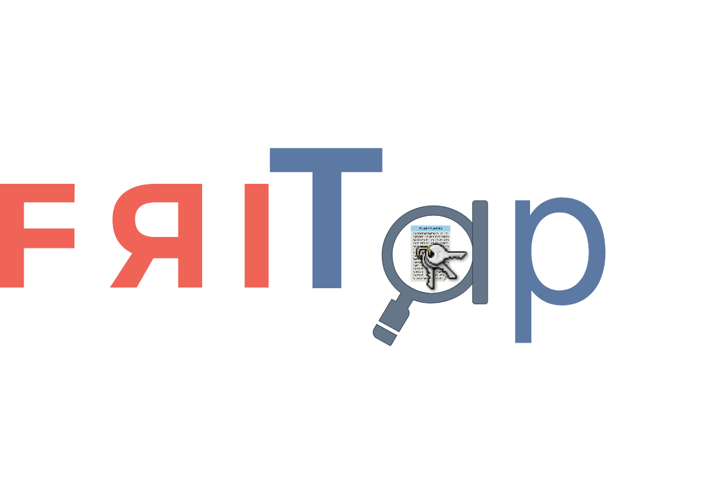

# friTap




The goal of this project is to help researchers to analyze traffic encapsulated in SSL or TLS. For details have a view into the [slides](assets/friTap.pdf).

This project was inspired by [SSL_Logger](https://github.com/google/ssl_logger ) and ccurrently supports all major operating systems (Linux, Windows, Android). More platforms will be added in future releases.

## Usage

On Linux we can easily attach to a process by entering its name or its PID:

```bash
$ sudo python3 ./friTap.py --pcap mycapture.pcap thunderbird
```


For Android we just have to add the -a parameter to indicate that we are now attaching (or spawning) an Android app:

```bash
$ sudo python3 ./friTap.py -a --pcap mycapture.pcap com.example.app
```

Further ensure that the frida-server is running on the Android device. More examples on using friTap can be found in the [USAGE.md](./USAGE.md).

## Supported SSL/TLS implementations and corresponding logging capabilities

```markdown
| Library                   | Linux         | Windows       | MacOSX | Android  | iOS                 |
|---------------------------|---------------|---------------|--------|----------|---------------------|
| OpenSSL                   |     Full      | R/W-Hook only |  TBI   |   Full   | TBI                 |
| BoringSSL                 |     Full      | R/W-Hook only |  TBI   |   Full   | Key extraction only |
| NSS                       | R/W-Hook only | R/W-Hook only |  TBI   |   TBA    | TBI                 |
| GnuTLS                    | R/W-Hook only | R/W-Hook only |  TBI   |   Full   | TBI                 |
| WolfSSL                   | R/W-Hook only | R/W-Hook only |  TBI   |   Full   | TBI                 |
| MbedTLS                   | R/W-Hook only | R/W-Hook only |  TBI   |   Full   | TBI                 |
| Bouncycastle/Spongycastle |               |               |        |   Full   | TBI                 |
| Conscrypt                 |               |               |        |   Full   |                     |
```
**R/W-Hook only** = Logging data sent and received by process<br>
**Key extraction only** = Only the keying material can be extracted<br>
**Full** = Logging data send and received by process + Logging keys used for secure connection<br>
**TBA** = To be answered<br>
**TBI** = To be implemented<br>


## Dependencies

- [frida](https://frida.re)
- >= python3.6

## Planned features

- [ ] add the capability to alter the decrypted payload
- integration with https://github.com/mitmproxy/mitmproxy
- integration with http://portswigger.net/burp/

- [ ] add wine support

- [ ] add further Libraries (have a look at this [Wikipedia entry](https://en.wikipedia.org/wiki/Comparison_of_TLS_implementations)):

- Botan 
- MatrixSSL
- ...

- Working with static linked libraries
- Add feature to prototype TLS-Read/Write/SSLKEY functions

- [ ] add iOS support (currently under development)

- [ ] Google traffic analysis


___

## Support

If you have any suggestions, or bug reports, please create an issue in the Issue Tracker.

In case you have any questions or other problems, feel free to send an email to:

[daniel.baier@fkie.fraunhofer.de](mailto:daniel.baier@fkie.fraunhofer.de).
