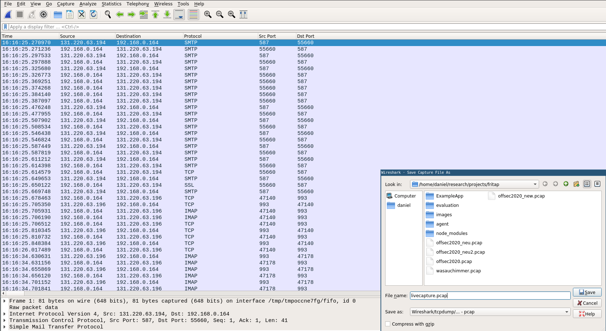

# Usage

Usage: friTap.py [-m] [-k <path>] [-l] [-p  <path>] [-s] [-v] [--enable_spawn_gating] <executable/app name/pid>

Decrypts and logs an executables or mobile applications SSL/TLS traffic.

Arguments:
  - `-m`, `--mobile` Attach to a process on android or iOS
  - `-k <path>`, `--keylog <path>` Log the keys used for tls traffic
  - `-l`, `--live` Creates a named pipe /tmp/sharkfin which can be read by Wireshark during the capturing process
  - `-p  <path>`, `--pcap <path>` Name of PCAP file to write
  - `-s`, `--spawn` Spawn the executable/app instead of attaching to a running process
  - `-v`, `--verbose` Show verbose output
  - `--enable_spawn_gating` Catch newly spawned processes. ATTENTION: These could be unrelated to the current process!
  - `<executable/app name/pid>` executable/app whose SSL calls to log

The target device needs to have frida-server running when Android or iOS apps are analyzed. Further information about setting up the device can be found [here](https://frida.re/docs/android/).

# Examples
## Spawn an app and show output on screen
`fritap -m com.example.app --spawn --verbose`

The output could look like this:


## Attach to a running app and write traffic to pcap
`fritap -m com.example.app -p myLogFile.pcap`

Output:


Note that the packets in this pcap currently only reflect the content, source and destination of packets. Certain IP/TCP header information may be omitted or set to default values. For a more precise output, log the traffic separately and decrypt it using the keys logged by the `-keylog` option (see example below). 
Also, when you try to analyse the resulting pcap, it might happen that wireshark mistakes the decrypted traffic for still being encoded because it still runs on port 443 (happens e.g. for HTTP2 traffic, Http1.1 seems to work fine). To circumvent this, just tell wireshark to decode traffic on port 443 as HTTP2 traffic (or  any other).

## Log keys of TLS traffic
`fritap -m -spawn --keylog myKeyLogFile.log com.example.app`

Output:


The script logs the keys used for encryption like described [here](https://developer.mozilla.org/en-US/docs/Mozilla/Projects/NSS/Key_Log_Format) in the given file. If you record the traffic from the app (e.g. with tcpdump) you can use this file to decrypt the traffic with wireshark. For more information, look [here](https://wiki.wireshark.org/TLS#Using_the_.28Pre.29-Master-Secret).

## Live view utilizing named pipes with Wireshark

```bash
$ fritap -l com.example.app
[*] Created named pipe for Wireshark live view to /tmp/tmp9is_q9_k/fritap_sharkfin
[*] Now open this named pipe with Wireshark in another terminal: sudo wireshark -k -i /tmp/tmp9is_q9_k/fritap_sharkfin
[*] friTap will continue after the named pipe is ready....

```

In another terminal we than open this named pipe with Wireshark:

```bash
$ sudo wireshark -k -i /tmp/tmp9is_q9_k/fritap_sharkfin &
```

Now we can see and analyze all the packets live with Wireshark. As soon as we stop the capturing friTap will exit. For later analysis it is than possible to safe the capture as pcap:

 


**Note:** It is not possible to safe the PCAP and having a live capture directly through friTap. If you want to safe the PCAP just use the capability of Wireshark to do so.


## Providing custom offsets/addresses

FriTap allows to specify user-defined offsets (starting from the base address of the ssl/socket library) and to specify absolute virtual addresses of ssl/socket functions for function resolution. For this a JSON file (see offsets_example.json) must be specified using the `--offsets` parameter.  If the parameter is set, then friTap will overwrite only those addresses of those functions that were specified. For all functions for which nothing was specified, friTap will try to detect an address on its own.

The JSON file consists of the following fields:

    - `address`: The offset or absolute address of the specified function, formatted as a hexadecimal string.
    - `absolute`:
        If `true`, the value in the `address` field is interpreted as an absolute address.
        If `false`, the value is treated as an offset from the base address of the SSL/socket library.

If friTap cannot find the base address of the socket/SSL library, or if the `absolute` field is set to `true`, the specified addresses will be interpreted as absolute addresses.

### **Example**:
Suppose friTap detects the base address of the OpenSSL library, but it fails to find exports for the `SSL_read` and `SSL_write` functions. If you know the offsets for these functions and the absolute addresses for certain socket functions, your JSON file could look like this:

```json
{
    "openssl":{
        "SSL_read": {
            "address":"0x15b4",
            "absolute":false
        },
        "SSL_write":{
            "address":"0x144c",
            "absolute": false
        }
    },
    "sockets":{
        "getpeername":{
            "address":"0x572115b4",
            "absolute":true
        },
        "getsockname":{
            "address":"0x5721163",
            "absolute":true
        },
        "ntohs":{
            "address":"0x572116f2",
            "absolute":true         
        },
        "ntohl":{
            "address":"0x572116c2",
            "absolute":true
        }
    }  
}
```
## Hooking by Byte-Patterns

In certain scenarios, the library we want to hook offers no symbols or is statically linked with other libraries, making it challenging to directly hook functions. For example:

    Cronet (libcronet.so) and Flutter (libflutter.so) are often statically linked with BoringSSL.

To solve this, we can use friTap with byte patterns to hook the desired functions. You can provide friTap with a JSON file that contains byte patterns for hooking specific functions, based on architecture and platform.
Hooking Categories

We define different hooking categories for which specific byte patterns are used. These categories include:

    Dump-Keys
    Install-Key-Log-Callback
    KeyLogCallback-Function
    SSL_Read
    SSL_Write

Each category has a primary and fallback byte pattern, allowing flexibility when the primary pattern fails.


### 1. Dump-Keys

This category is responsible for dumping keys directly from the process. The primary and fallback byte patterns in this category are used to hook functions that deal with key management and extraction. friTap provides than the parsing in order to extract the keys:

```json
"Dump-Keys": {
  "primary": "AA BB CC DD EE FF ...", 
  "fallback": "FF EE DD CC BB AA ..."
}
```
    Primary Pattern: Used to hook the function that allows key dumping.
    Fallback Pattern: If the primary pattern fails, the fallback pattern is tried.

Our developed tool [BoringSecretHunter](https://github.com/monkeywave/BoringSecretHunter) can be used to automatically extract these patterns from a target library.

### 2. Install-Key-Log-Callback

This category installs a callback for logging TLS keys. It typically works alongside `KeyLogCallback-Function`. Both must be specified together in the JSON. As the name suggests it is responsbile for installing the keylog callback function:

```json
"Install-Key-Log-Callback": {
  "primary": "11 22 33 44 55 66 ...",
  "fallback": "66 55 44 33 22 11 ..."
}
```
    Primary Pattern: Hook the function responsible for installing the key log callback.
    Fallback Pattern: If the primary pattern fails, this fallback pattern is tried.

### 3. KeyLogCallback-Function

This category hooks the function that is triggered by the installed key log callback. It must be used alongside the Install-Key-Log-Callback category. It is also used for extracting the TLS key material but **no parsing** has to be done:

```json
"KeyLogCallback-Function": {
  "primary": "77 88 99 AA BB CC ...",
  "fallback": "CC BB AA 99 88 77 ..."
}
```
    Primary Pattern: Hook the function where the key log callback processes keys.
    Fallback Pattern: If the primary pattern fails, this fallback pattern is tried.

###  4. SSL_Read

This category hooks the SSL_Read function, which is responsible for reading encrypted SSL/TLS data. It works alongside the SSL_Write category.

```json
"SSL_Read": {
  "primary": "AA 55 FF 00 11 22 ...",
  "fallback": "22 11 00 FF 55 AA ..."
}
```
    Primary Pattern: Hook the SSL_Read function.
    Fallback Pattern: If the primary pattern fails, the fallback pattern is tried.

### 5. SSL_Write

This category hooks the SSL_Write function, which is responsible for writing encrypted SSL/TLS data. It must be used with the SSL_Read category.

```json
"SSL_Write": {
  "primary": "BB CC DD EE FF 00 ...",
  "fallback": "00 FF EE DD CC BB ..."
}
```
    Primary Pattern: Hook the SSL_Write function.
    Fallback Pattern: If the primary pattern fails, the fallback pattern is tried.


## Recovering TLS secrets from heap memory (`-ms` / `--memory-scan`)

Instead of hooking the TLS library, friTap can recover TLS secrets by **scanning the target process's heap memory**. This runs as a separate, independently-injected Frida agent (`friTap/fritap_memscan.js`) that periodically re-scans the heap and writes what it finds as a standard NSS keylog. It is complementary to the normal capture and works on both the default (legacy) and `--modern` agent paths, on every OS Frida supports. All scan engines live in one central profile database (`friTap/memory_scanning/patterns.json`); you can point `-ms` at your own pattern/profile JSON to override or extend it.

**Which engine runs is driven by the selected `--protocol` set and the platform**, resolved from that central database:

- `-ms` with the default `--protocol tls` scans **BoringSSL** (validated on Android/Chrome) on every platform, and **additionally scans Schannel** on Windows by attaching a **read-only** scan to `lsass.exe` (skipped with `-nl`/`--no-lsass`). The Schannel offsets are verified on Windows 11 **arm64** (build 26200); **x64** ships uncalibrated (see `dev/schannel_calibrate/`) and falls back to friTap's normal ncrypt/lsass hooking path.
- `-ms` with `--protocol rc4` scans the **RC4** engine (S-box / candidate-key recovery) instead of any TLS engine.
- `-ms` with `--protocol tls,rc4` scans every applicable engine (e.g. on Windows: BoringSSL + Schannel + RC4).
- `-ms <engine>` (e.g. `-ms schannel`, `-ms rc4`, `-ms boringssl`) is a **targeted** override that scans only that engine, regardless of `--protocol`.
- `-ms mtproto` (alias `-ms telegram`) scans the **MTProto/Telegram** engine on **Android arm64 only** (matches `libtmessages.*.so`), recovering Telegram cloud and E2E secret-chat keys in a single pass. Live recovery writes them to a sidecar `<stem>.mtproto.keylog` (containing both `MTPROTO_AUTH_KEY` and `MTPROTO_E2E_KEY` lines). See [Capturing Telegram / MTProto keys](#capturing-telegram--mtproto-keys).

Schannel TLS secrets recovered from `lsass` have no memory-resident client-random, so they are written **unpaired** to `<stem>.schannel.unpaired`; run the offline decryptor with `--schannel-unpaired` to correlate them against a capture and emit a normal, Wireshark-loadable NSS keylog.

- Passed **alone**, `-ms` is the only thing loaded (the normal TLS-hooking agent is skipped) and keys land in `<target>_memscan.keylog` in the current directory.
- Combined with `-k <file>`, the recovered keys are written to a dedicated file **beside** it — `<stem>.memscan<ext>` (e.g. `-k keys.log` → `keys.memscan.log`) — so the heap scanner never shares a file handle with the hooked-key writer.
- Combined with `-p`/`-c`/etc., the memory-scan agent runs alongside the normal capture.
- `--memory-scan-interval <seconds>` sets how often the heap is re-scanned (default `2.0`; only effective with `-ms`).

> **Note:** the pattern file argument is optional, so `fritap -ms com.app` wrongly treats `com.app` as the pattern file. Put the target after `--`, or pass the pattern file explicitly before the target.

### Examples

```bash
# Heap-only secret recovery; keys written to com.android.chrome_memscan.keylog
fritap -ms -- com.android.chrome

# Memory scan alongside a normal capture, sharing one keylog
fritap -ms -k keys.keylog -p out.pcap -- com.android.chrome

# Custom pattern/profile file (before the target)
fritap -ms my_patterns.json com.android.chrome

# Windows: default -ms also read-only-scans lsass for Schannel secrets
fritap -ms -k keys.log -p out.pcap -- some_windows_app.exe
# (skip the lsass scan with -nl / --no-lsass)

# Targeted: only the Schannel engine (read-only lsass scan)
fritap -ms schannel -- some_windows_app.exe

# Telegram/MTProto heap key recovery (Android arm64; writes <stem>.mtproto.keylog)
# `-ms telegram` is an alias for `-ms mtproto`
fritap -m -ms mtproto com.example.telegram
```

Verify the recovered keylog against a matching capture in Wireshark/tshark:

```bash
tshark -r capture.pcap -o tls.keylog_file:keys.keylog \
  -o tls.ignore_ssl_mac_failed:FALSE -Y "http || http2"
```

## Capturing RC4 keys (`--protocol rc4`)

RC4 is a first-class protocol. It is **independent of TLS** — select it explicitly, alone or alongside `tls`:

- `--protocol rc4` — standalone RC4 (RC4 hooks only; no TLS hooks).
- `--protocol tls,rc4` (or `--protocol tls --protocol rc4`) — RC4 **nested inside TLS** (plaintext → RC4 → TLS): both TLS keys and RC4 keys are captured.
- `--protocol tls` — no RC4 hooks.

RC4 **keys** are recovered on every platform by hooking key-setup functions — OpenSSL/LibreSSL/BoringSSL `RC4_set_key`, Nettle `nettle_arcfour_set_key`, mbedTLS `mbedtls_arc4_setup`, and on Windows the CNG (`BCryptGenerateSymmetricKey`) and legacy CryptoAPI (`CryptEncrypt`/`CALG_RC4`) providers — and are written to a dedicated keylog (`RC4_KEY <key_hex> <len> <source> <direction> <assoc>` lines). RC4 keys can also be recovered heap-side with `-ms --protocol rc4` (S-box permutation scan + candidate-key trial-decrypt).

Decrypt a capture offline by feeding the RC4 keylog back in with `--rc4-keylog`. The offline decryptor auto-detects the two cases: with a TLS keylog present it first strips TLS (via tshark) and then peels RC4 (the nested case); without one it strips RC4 directly from the raw TCP payloads (standalone).

```bash
# Standalone RC4
fritap --protocol rc4 -k rc4keys.log -p out.pcap -- ./rc4_app

# RC4 nested inside TLS 1.3 (captures both layers' keys)
fritap --protocol tls,rc4 -k keys.log -p out.pcap -- ./app

# Offline: peel TLS then RC4
fritap --from-pcap out.pcap --keylog keys.tls.log --rc4-keylog keys.rc4.log
```

## Capturing Telegram / MTProto keys

Telegram's MTProto 2.0 keys can be recovered heap-side with the memory scanner. `-ms mtproto` (alias `-ms telegram`) scans `libtmessages.*.so` on **Android arm64 only** and recovers, in one pass, both the cloud keys and the E2E secret-chat keys. Live recovery writes them to a sidecar file `<stem>.mtproto.keylog`, which contains both `MTPROTO_AUTH_KEY` and `MTPROTO_E2E_KEY` lines.

```bash
# Live recovery of Telegram cloud + E2E keys (Android arm64)
fritap -m -ms mtproto com.example.telegram

# `-ms telegram` is an alias for `-ms mtproto`
fritap -m -ms telegram com.example.telegram
```

The workflow is **capture → recover keys → decrypt offline**. With memory scanning on, you do **not** need to capture each TCP stream from its first 64 bytes: the OBF scanner recovers the live obfuscated-transport AES-CTR state from memory, and the offline decryptor seeks that counter into a mid-stream capture (`recover_obf_alignment`). So already-open connections decrypt offline as long as:

1. the connection is **alive during a scan pass** — keep Telegram in the foreground and exchange a few messages so the stream stays open while the scanner runs (a stream that closes before the scan cannot have its CTR state recovered);
2. you capture **some recent traffic** on that stream — alignment anchors within roughly ~64 KB of the live counter, so a short burst of fresh traffic near the scan is enough to seek the counter;
3. the **transport AUTH key is recovered by the same scan**, and for E2E send SEVERAL messages so the secret-chat keys are resident when you scan. MTProto 2.0 uses PFS temp keys, so the temp key must be resident at scan time.

Spawning (`-s`) is only needed to catch connections that close before the scan, or when you are not running a memory scan at all.

### Offline: decrypt cloud and E2E chats

Feed the recovered keylog back into the shipped offline decryptor with `--mtproto-keylog`. This decrypts **both** cloud chats and E2E secret chats from the single keylog — no separate research tool is needed. `--telegram-keylog` is equivalent.

```bash
fritap --from-pcap cap.pcap --mtproto-keylog x.mtproto.keylog --tap out.tap
```

## Using friTap with a custom Frida scripts

This guide explains how to use friTap with a custom Frida script to enhance its functionality. Using the `-c` parameter, you can specify a custom script to be executed during the friTap session.  This custom script will be invoked just before friTap applies its own hooks.

---

### Example Command

To invoke friTap with a custom script, use the following command:

```bash
fritap -m -k cronet18.keys -do -c "/path/to/custom.js" -v YouTube
```

### **Explanation of Parameters**
- `-m`: Indicates that the app is running on a mobile device.
- `-k`: Specifies the output file for the SSL key log.
- `-do`: Enables debug output for detailed logging.
- `-c`: Specifies the path to the custom Frida script to be executed.
- `-v`: Enables verbose logging.
- `YouTube`: The name of the app package to be hooked.

---

### Custom Script Example

The following is an example of a custom Frida script (`custom.js`) that iterates over all loaded modules, checks for exports containing `ssl` or `tls`, and sends relevant information to friTap.

```javascript
/*
 * Example code for using custom hooks in friTap. 
 * To ensure friTap prints content, include a "custom" field in your message payload. 
 * The value of this "custom" field will be displayed by friTap.
 */

// Iterate over all loaded modules
Process.enumerateModules().forEach(module => {
    // Enumerate exports for each module
    module.enumerateExports().forEach(exp => {
        // Check if the export name contains "ssl" or "tls"
        if (exp.name.toLowerCase().includes("ssl") || exp.name.toLowerCase().includes("tls")) {
            // Send the result to Python
            send({
                custom: `Found export: ${exp.name} in module: ${module.name} at address: ${exp.address}`
            });
        }
    });
});
```
friTap will print any messages sent with a `custom` field during execution.
You can download the above example code as `custom.js` file using the link below:

**[Download custom.js](./custom.js)**

Place this file in the same directory as your friTap installation or provide the absolute path to the `-c` parameter.


