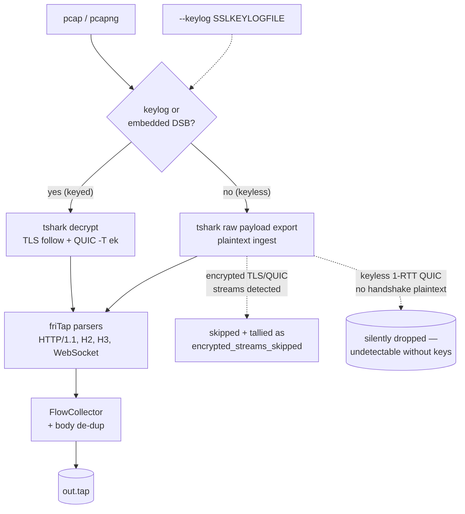

# Offline pcap → .tap conversion

friTap can reconstruct a friTap `.tap` file from a capture you already have on
disk — no live target, no Frida attach. This is the *offline* path: you bring a
`pcap`/`pcapng` (and, when the traffic is encrypted, the TLS keys), and friTap
produces the same rich `.tap` you would get from a live capture, ready for
[`fritap analyze`](traffic-analysis.md) and the [replay TUI](../getting-started/tui.md).

!!! warning "Requires Wireshark / tshark ≥ 4.x"
    Every example on this page shells out to **tshark** (the Wireshark CLI) to
    dissect and — when keys are available — decrypt the capture. tshark is **not**
    bundled with friTap and is **not guaranteed to be installed**. Install
    Wireshark (`brew install wireshark`, `apt install tshark`, or
    [wireshark.org](https://www.wireshark.org/)). If tshark is not on your `PATH`
    (common on macOS, where it lives in `Wireshark.app`, and on Windows), point
    friTap at it with `--tshark-path` or the `$FRITAP_TSHARK` environment
    variable. tshark **< 4.0** is accepted but warns: QUIC field names may be
    unstable.

If you just want the 5-minute happy path, start with the
[Offline quickstart](../getting-started/offline-quickstart.md) and come back here
for the details, caveats, and the Python API.

---

## What it does

The offline pipeline has two distinct modes, chosen automatically from the inputs:

- **tshark-decrypt (keyed).** When you pass `--keylog` *or* the capture is a
  `pcapng` carrying an embedded **Decryption Secrets Block (DSB)**, friTap drives
  tshark to decrypt the TLS and QUIC streams, then feeds the recovered plaintext
  through friTap's own protocol parsers (HTTP/1.1, HTTP/2, HTTP/3, WebSocket, …)
  to build flows.
- **Plaintext ingest (keyless).** When you pass *no* keys and there is *no* DSB,
  friTap treats the capture as already-cleartext and ingests the raw transport
  payload (`tcp.payload` / `udp.payload`) directly. Streams that are *genuinely*
  encrypted are detected, skipped, and tallied (see
  [Caveats](#caveats-read-before-you-trust-the-output)).

In both modes the result is the same `.tap` format used everywhere else in
friTap — see the [.tap format spec](../api/tap-format.md).



---

## CLI: `--from-pcap`

The offline pipeline is invoked through the main `fritap` entry point whenever
`--from-pcap` appears in the arguments. It owns a small, dedicated set of flags:

```bash
# requires Wireshark/tshark ≥ 4.x
fritap --from-pcap chrome.pcap --keylog chromekeys.log --tap out.tap
```

| Flag | Purpose |
| --- | --- |
| `--from-pcap <file>` | **Required.** The capture file (`pcap` or `pcapng`). |
| `--keylog <file>` | NSS `SSLKEYLOGFILE` used to decrypt TLS/QUIC. Omit for a plaintext capture or a DSB-embedded `pcapng`. |
| `--tap <file>` | Output `.tap` path. Defaults to `<pcap stem>.tap`. |
| `--scan` | Run the analyzers over the produced `.tap` and report a finding count. See [Traffic analysis](traffic-analysis.md). |
| `--tls-port <port>` | Custom TCP port to Decode-As TLS. Repeatable. |
| `--quic-port <port>` | Custom UDP port to Decode-As QUIC. Repeatable. (443 is always included.) |
| `--decode-as <rule>` | Raw tshark `-d` Decode-As rule, passed through verbatim. Repeatable. |
| `--tls-heuristic` | Enable tshark's TLS-over-TCP heuristic dissection (finds TLS on non-standard ports without an explicit `--tls-port`). |
| `--tshark-path <path>` | Path to the tshark binary. Else auto-discovered (also honors `$FRITAP_TSHARK`). |

!!! tip "Direction labelling on non-standard ports"
    friTap labels `write` (client→server) vs `read` (server→client) by the
    **server port**. For correct direction on a non-standard TLS port you must
    pass that server port via `--tls-port`; otherwise friTap falls back to
    "whoever sent application data first is the client".

This page documents only the offline sub-flags. For the complete `fritap` flag
reference, see [CLI reference](../api/cli.md).

---

## Manifest sidecar: `<pcap>.fritap.json`

A live friTap capture writes a sidecar manifest next to the pcap so that an
offline reconstruction can find the keys and ports automatically. If a file named
`<pcap>.fritap.json` sits beside your capture, friTap reads it and fills in any
value you did **not** pass on the command line.

```json
{
  "keylog": "chromekeys.log",
  "tls_ports": [4433, 8443],
  "quic_ports": [8443]
}
```

Recognized keys: `keylog`, `tls_ports`, `quic_ports`. A missing or unreadable
manifest is treated as empty (no error).

**Precedence — explicit always wins:**

```
CLI flag  >  manifest value  >  built-in default
```

So `--keylog other.log` overrides the manifest's `keylog`, but if you omit
`--keylog` the manifest's value is used. The same holds for `--tls-port` /
`--quic-port`.

---

## Keyed vs keyless behavior

| | **Keyed** (`--keylog` or DSB) | **Keyless** (no keys) |
| --- | --- | --- |
| What is read | Decrypted TLS app-data + decrypted QUIC stream data | Raw `tcp.payload` / `udp.payload` of an already-plaintext capture |
| Encrypted streams | Decrypted into flows | Detected, **skipped**, and counted as `encrypted_streams_skipped` |
| Missing `--keylog` file | **Fails loud** — `NoDecryptionKeysError` (exit 5). A typo'd key path is never silently masked as "plaintext". | n/a |
| TLS/QUIC handshake metadata | SNI, ALPN, cipher, version enriched onto flows | SNI/version still recoverable from plaintext handshake; cipher/ALPN need keys |

The "fail loud" rule matters: if you pass `--keylog` but the file does not exist
(and there is no DSB), friTap stops with `NoDecryptionKeysError` rather than
falling through to the plaintext path and producing a misleading `.tap`.

---

## Caveats (read before you trust the output)

!!! danger "Keyless captures have hard, silent limits"
    The keyless plaintext path is best-effort. Three behaviors will surprise you
    if you do not know them.

    **1. Keyless 1-RTT QUIC is undetectable — and silently dropped.**
    To tell a *genuinely encrypted* QUIC stream apart from friTap's own decrypted
    HTTP/3 (which also rides on UDP/443), friTap looks for a handshake marker: a
    QUIC `ClientHello` or a long-header Initial bearing a registered QUIC version.
    A capture that begins **mid-connection** (1-RTT only, no handshake) carries
    **no such plaintext marker**, so tshark cannot classify it and friTap cannot
    distinguish it from raw payload. Such streams are **silently skipped** — they
    appear in neither the flows nor the `encrypted_streams_skipped` tally. *To
    capture this traffic you need the keys* (`--keylog` or a DSB pcapng).

    **2. Encrypted streams are skipped and tallied.** In the keyless path, any
    TLS/QUIC stream that *does* carry a recognizable encrypted record is skipped
    (it would need keys) and counted in `ConvertResult.encrypted_streams_skipped`.
    The CLI prints a hint:
    ```text
    Warning: no plaintext application data was produced; 3 stream(s) look
    encrypted (TLS/QUIC) and were skipped. This capture needs keys — pass
    --keylog <SSLKEYLOGFILE>, or use a pcapng with an embedded Decryption
    Secrets Block (DSB).
    ```

!!! note "Synthetic, metadata-only flows"
    SSH connections (banners + KEXINIT) are **plaintext** and need no keys, but
    friTap cannot recover the encrypted SSH payload. These — along with
    HTTP/2 control frames and similar control-plane traffic — surface as
    **synthetic, metadata-only flows**: a flow record carrying the handshake
    metadata (client/server version, KEX, cipher, MAC) but no body. They are
    purely additive; a failure here never aborts the conversion.

!!! info "Body de-duplication"
    Reconstructed request/response bodies are **de-duplicated** when written to
    the `.tap`: a body that is fully recoverable from its chunks is stored with a
    `body_from_chunks` flag and **no** duplicate blob, then rebuilt on read via
    `Flow.request_body` / `Flow.response_body`. This is transparent — it only
    matters if you parse the raw `.tap` yourself (see the
    [.tap format spec](../api/tap-format.md)).

---

## Exit codes

`fritap --from-pcap` returns:

| Code | Meaning |
| --- | --- |
| `0` | Success — decrypted/ingested application data was written. |
| `2` | pcap not found. |
| `3` | tshark could not be located (install it or pass `--tshark-path`). |
| `4` | Ran successfully but produced **no** application data (usually wrong keys/ports, or an encrypted keyless capture). A warning explains which case applies. |
| `5` | No decryption keys — `--keylog` was given but missing, and there is no embedded DSB (`NoDecryptionKeysError`). |
| `1` | Any other conversion failure (e.g. tshark exited non-zero). |

---

## Python API: `pcap_to_tap()`

The same conversion is available programmatically. Import it from the **friTap
package root** (it is intentionally *not* re-exported from `friTap.offline`,
where it would shadow the `pcap_to_tap` *module*):

!!! warning "Requires Wireshark/tshark ≥ 4.x"
    `pcap_to_tap()` shells out to tshark exactly as the CLI does. The same
    installation/`--tshark-path` notes apply (`tshark_path=` argument).

```python
from friTap import pcap_to_tap   # NOT from friTap.offline

result = pcap_to_tap(
    "chrome.pcap",
    keylog_path="chromekeys.log",   # omit for a plaintext / DSB capture
    tap_path="out.tap",             # default: <pcap stem>.tap
    tls_ports=(4433,),              # extra Decode-As TLS ports
    quic_ports=(),                  # extra Decode-As QUIC ports (443 always on)
    extra_decode_as=(),             # raw tshark -d rules
    heuristic=False,                # TLS-over-TCP heuristic dissection
    run_scan=False,                 # run analyzers afterward
    capture_target="",              # label stored in the .tap (default: basename)
    tshark_path=None,               # explicit tshark binary; else auto-discovered
    use_manifest=True,              # honor a <pcap>.fritap.json sidecar
)

print(result.to_dict())
```

`pcap_to_tap()` is the manifest-aware wrapper (CLI > manifest > defaults). For a
no-manifest core call, use `friTap.offline.pcap_to_tap.convert_pcap_to_tap()`.

It returns a `ConvertResult`:

| Field | Meaning |
| --- | --- |
| `tap_path` | Path to the written `.tap`. |
| `flow_count` | Number of flows reconstructed. |
| `decrypted_packet_count` | Application-data packets ingested (0 → exit code 4 on the CLI). |
| `stream_count` | Distinct streams observed. |
| `dropped_packet_count` | QUIC packets dropped (e.g. misaligned stream id / payload lists). |
| `dropped_stream_count` | TLS streams that could not be followed/decoded. |
| `findings_count` | Findings, when `run_scan=True`. |
| `encrypted_streams_skipped` | Encrypted streams skipped in the keyless path. |

`ConvertResult.to_dict()` gives a JSON-safe view for web/API callers.

`pcap_to_tap()` raises `NoDecryptionKeysError` (a `ValueError`) when the capture
is encrypted and no keys are available; other tshark/IO failures propagate as
their native exceptions.

---

## See also

- [Offline quickstart](../getting-started/offline-quickstart.md) — the 5-minute happy path.
- [Traffic analysis](traffic-analysis.md) — `fritap analyze` / `--scan`.
- [Replay TUI](../getting-started/tui.md) — open a `.tap` interactively.
- [.tap format spec](../api/tap-format.md) — the on-disk format.
- [CLI reference](../api/cli.md) — every `fritap` flag.
