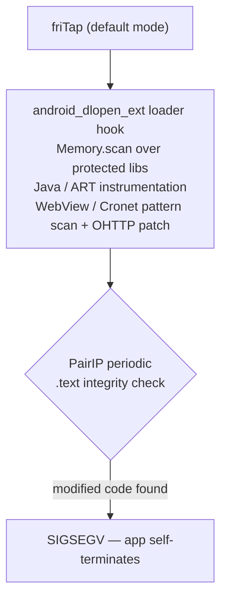
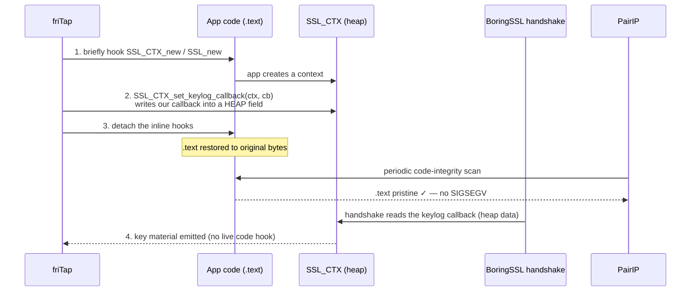
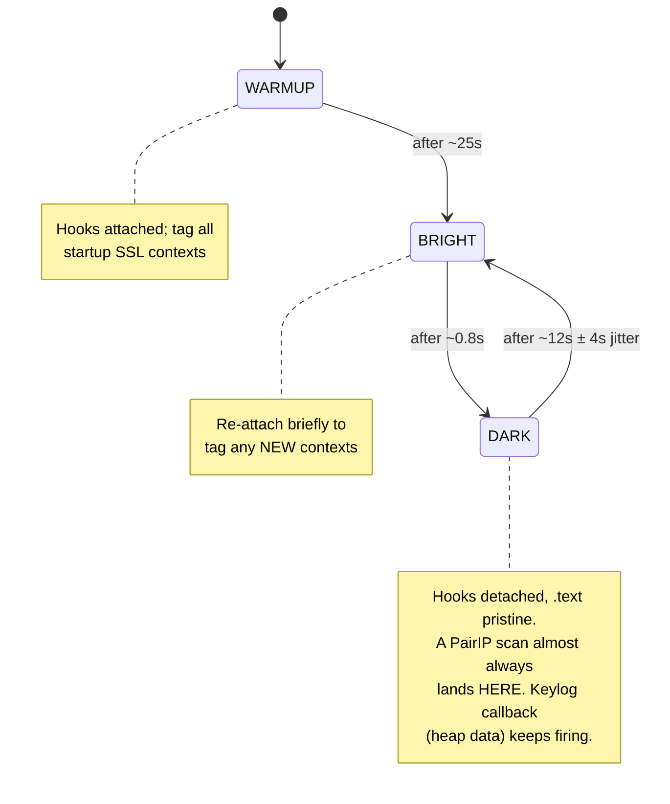
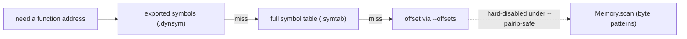

# PairIP-Protected Apps (`--pairip-safe`)

Google **PairIP** (`libpairipcore.so`) is a VM-based Play-Integrity / anti-tamper
runtime shipped with many Google Play apps (and some large titles such as
Blizzard's *Warcraft Rumble* and the Battle.net mobile client). It runs a
**periodic in-process code-integrity check** and **self-terminates the app with a
`SIGSEGV`** the moment it finds an inline hook in a library it protects. friTap's
normal hooking footprint trips that check, so the default capture path crashes the
target before you see a single key.

`--pairip-safe` is a minimal, **scan-free** Android capture mode that survives
PairIP long enough to extract TLS keys — by leaving the app's *code* untouched and
hiding friTap's footprint in plain sight.

!!! warning "This is not a PairIP bypass"
    `--pairip-safe` does not defeat, patch, or neutralize PairIP. It simply avoids
    the operations PairIP looks for, and persists through a trick that lives in
    heap *data* rather than code. Capture is best-effort and depends on *where*
    the app's TLS actually lives (see [Limitations](#limitations)). Evading
    anti-tamper in general is a broad, unsolved Frida-on-Android problem and is
    **out of scope** for friTap.

---

## The PairIP mental model

Three facts explain everything `--pairip-safe` does — and why it has to be built
the strange way it is.

**1. The kill is an in-process `SIGSEGV`, not a syscall or `ptrace` trick.** PairIP
checksums loaded code from inside the app's own threads and raises `SIGSEGV` on a
mismatch. You cannot defang it by hooking `kill` or `syscall` — by the time it
fires, you've already lost.

**2. What trips it is friTap's *broad footprint*, not the act of attaching.** Plain
`frida -U -f <pkg>` with no script does **not** crash a PairIP app, because it
patches no code. The operations PairIP detects are friTap's heavy machinery:



**3. In practice, only the app's *own* libraries appear to be in PairIP's checksum
scope.** This is an observation, not a documented spec: inline hooks on system
libraries under `/apex` and `/system` (Conscrypt's `libssl.so`, the mainline
`libhttpengine.so`) have been **observed to survive**, while an inline hook on an
**app-bundled** library shipped inside the split APK (e.g. `libunity.so`) was
**detected and the app was killed**. That asymmetry is what makes some hooks safe
and others risky (see [Unity](#unity-libunity-opt-in)).

When friTap detects PairIP it prints:

```
[!!!] ANTI-TAMPER PROTECTION DETECTED: Google PairIP (libpairipcore.so)
  VM-based Play-integrity / anti-tamper; checksums loaded code and self-terminates (SIGSEGV) when it detects an inline hook.
  -> friTap's inline hooks may be detected; the app may crash (SIGSEGV).
  See fkie-cad/friTap#64. There is no in-tool PairIP bypass.
```

---

## The idea in one picture

PairIP only checksums **code** (`.text`). So `--pairip-safe` puts nothing
persistent *in* the code. The standard BoringSSL keylog API,
`SSL_CTX_set_keylog_callback`, stores a callback pointer in a **field of the
heap-allocated `SSL_CTX` struct** — that's *data*, not a code patch. friTap
exploits this:



The persistent footprint is a **heap data write**; the code hooks exist only for
the instant it takes to make that write, then they're gone. PairIP's code scan
never has anything to find.

This is the whole trick. Everything below is about doing it *reliably* and
*repeatedly* over the lifetime of the app.

---

## Blink: staying invisible over time

Two problems remain. New `SSL_CTX` objects created *after* we detach still need
tagging. And PairIP scans *periodically* — we must not be holding a code hook when
a scan lands. **Blink** solves both by toggling the inline hooks on a jittered
schedule:



- **Warmup (~25 s):** stay BRIGHT so the app's initial contexts are reliably
  tagged.
- **BRIGHT (~0.8 s):** a short re-tag window for contexts born during DARK.
- **DARK (~12 s ± 4 s):** code is pristine. The ± jitter de-syncs friTap from
  PairIP's scan cadence so the two can't phase-lock.

The keylog callback persists across every state because it lives in heap data, and
friTap permanently **GC-roots** the callback object — if Frida ever freed it, the
contexts still pointing at it would crash exactly like a PairIP kill. (Mechanism in
`agent/shared/pairip_blink.ts`.)

!!! note "Blink shapes *when* you capture"
    Because the hooks are detached most of the time after warmup, a **lone** new
    handshake usually lands in a DARK window and is missed. Capture is most
    reliable for handshakes that happen **during warmup** or that reuse a context
    tagged earlier. See [Forcing traffic](#forcing-traffic-and-the-0-keys-case).

### Two capture paths

Not every library exports a keylog API. friTap uses one of two paths per library:

| Path | Used for | How keys are read | Survives PairIP because… |
| --- | --- | --- | --- |
| **A — keylog callback** (heap write, blinks) | libs that export `SSL_CTX_set_keylog_callback` (`libssl`, `libhttpengine`, `libcommerce_http_client`, Conscrypt) | callback fires during the handshake | persistent footprint is heap data; code hooks blink away |
| **B — `ssl_log_secret` offset** (inline hook, no blink) | fully-stripped libs with no keylog API (System WebView) | reads `(ssl, label, secret)` from the function's args on entry | the lib is **system-provided**, outside the app's checksum scope (fact #3) |

Path B is a plain inline code hook, so it only works on libraries PairIP doesn't
checksum — which is why it's reserved for system WebView and why app-bundled libs
like Unity are opt-in and risky.

---

## What `--pairip-safe` changes

| Aspect | Default friTap | `--pairip-safe` |
| --- | --- | --- |
| TLS library selection | auto-detect + library scan | curated **allowlist** only |
| Symbol resolution | exports → symbols → **`Memory.scan`** | exports → symbols → **offsets** (never `Memory.scan`) |
| `android_dlopen_ext` loader hook | yes | **disabled** |
| Java / ART hooks (e.g. provider install) | yes | **disabled** |
| WebView/Cronet pattern scan, OHTTP patch | yes | **disabled** |
| Hook persistence | static | **"blink"** (see above) |

Resolution is **scan-free** — friTap never byte-scans a protected library, because
a `Memory.scan` over its `.text` is itself enough to trip PairIP. The ladder:



Exports and the `.symtab` scan are both scan-free and PairIP-safe (some
`libhttpengine.so` builds, for example, keep `SSL_*` only in `.symtab`). Offsets
are the **last resort** because they are fragile across device and library versions
(see [WebView capture](#capturing-a-stripped-webview-chromium-login)). If nothing
resolves, the library simply isn't hooked — it is never scanned.

---

## What gets hooked (the allowlist)

`--pairip-safe` hooks only a small, curated set of TLS libraries. Current entries:

| Library | Type | Path | Notes |
| --- | --- | --- | --- |
| `libssl.so` | BoringSSL/OpenSSL | A (symbol) | Conscrypt; system `/apex` (safe) |
| `libhttpengine.so` | BoringSSL | A (symbol, `.symtab`) | mainline Cronet; system `/apex` (safe) |
| `libjavacrypto.so` | BoringSSL | A (symbol) | Conscrypt JNI |
| `libconscrypt_*jni.so` | BoringSSL | A (symbol) | Conscrypt |
| `libcommerce_http_client.so` | BoringSSL | A (symbol) | app SDK (e.g. Blizzard commerce; loads only when used) |
| `libwebviewchromium.so` | BoringSSL | B (**offset**) | System WebView (Chromium); login WebView — see [WebView capture](#capturing-a-stripped-webview-chromium-login) |
| `libunity.so` | MbedTLS (UnityTLS) | **offset, opt-in** | app-bundled; see [Unity](#unity-libunity-opt-in) |

Late-loaded libraries (the WebView that appears only when a login page renders, or
in spawn mode the TLS libs that load after resume) are picked up automatically by a
non-invasive watcher — no loader hook, no breakpoint, no scan. In spawn mode that
watcher deliberately waits out PairIP's startup integrity window before hooking.

---

## Adding a library to scope

Everything above — the registry, the late-load watcher, and the blink loop — is
driven from **one array**, `PAIRIP_SAFE_LIBS` in
`agent/shared/pairip_safe_libs.ts`. Adding a library is a single entry there, and
all three subsystems pick it up at once. There are two cases.

**Symbol-exporting BoringSSL / Conscrypt lib** (the turnkey case — Path A). Reuse an
existing executor and mark it `resolution: "symbol"`:

```ts
{
    pattern: /.*libmytls\.so/, library: "My TLS lib (BoringSSL)",
    libraryType: "boringssl", protocol: "tls",
    hookFn: (m) => (m ? httpengine_execute_modern : httpengine_execute),
    resolution: "symbol",
}
```

Use `boring_execute*` if the SSL symbols are exported in `.dynsym`, or
`httpengine_execute*` if they live only in `.symtab` (it opts the module into deep
symbol resolution). That's the entire change — rebuild the agent and the library is
in scope for `--pairip-safe`.

**Hidden-symbol / statically-linked lib** (Path B — offset). Mark it
`resolution: "offset"` and give it an `offsetKey` (defaults to the module name):

```ts
{
    pattern: /.*libmystatic\.so/, library: "My static BoringSSL",
    libraryType: "boringssl", protocol: "tls",
    hookFn: (m) => (m ? boring_execute_modern : boring_execute),
    resolution: "offset", offsetKey: "libmystatic.so",
}
```

You then supply the function offset **at runtime**, no rebuild required:

```bash
--offsets '{"libmystatic.so":{"ssl_log_secret":{"address":"0x...","absolute":false}}}'
```

Because the pattern (`Memory.scan`) tier is hard-disabled under `--pairip-safe`, an
offset library that has no offset supplied degrades to "not hooked" rather than
falling back to a scan. Remember Path B is a non-blinking inline hook — only safe on
libraries outside PairIP's checksum scope.

---

## Usage

```bash
# Attach (the proven path) — app already running:
fritap -m -k keys.log --pairip-safe -v <pid|package>

# Spawn — catches more of startup, but hooks are deferred (see below):
fritap -m -k keys.log --pairip-safe -v -s com.example.app
```

### Attach vs spawn

- **Attach** is the proven path. Already-resident TLS libs are hooked immediately,
  and the late-load watcher's first sweep follows ~1.5 s later — so you control
  exactly when (drive traffic right after the `keylog hooks installed` banner).
- **Spawn** (`-s`) defers hook installation **~8 s past resume** to let PairIP's
  startup integrity sweep finish before any hook lands. The trade-off: the app's
  **earliest** handshakes (which often complete in the first few seconds) are
  **missed**. Spawn does not magically produce keys.

---

## Forcing traffic and the "0 keys" case

!!! tip "0 keys is usually *no catchable traffic*, not a broken hook"
    If a run captures 0 keys, the hooks almost certainly installed fine — the app
    just didn't perform a TLS handshake on a hooked library **during the capture
    window**. Verify with `adb shell` (as root):

    ```bash
    # the target's own :443 connections (replace <pid>)
    adb shell "su -c 'ss -tunp | grep :443 | grep pid=<pid>'"
    ```

    An app sitting on a cached-session main menu is frequently **network-idle**
    (zero of its own `:443` sockets); there is simply nothing to capture.

To capture, you need a **fresh handshake on a hooked library while hooks are
attached** (ideally during warmup). Options:

- **Drive the app**: log in, open a screen that fetches data, start gameplay —
  whatever causes new TLS.
- **Toggle connectivity** to force reconnect handshakes — useful only when the app
  has live connections it will re-establish:

  ```bash
  adb shell cmd connectivity airplane-mode enable
  adb shell cmd connectivity airplane-mode disable
  ```

  Do this **right after** the `keylog hooks installed` banner so reconnects land
  inside the warmup window.

---

## Capturing a stripped WebView / Chromium login

Many apps render their login (e.g. a Battle.net OAuth page) in an in-app WebView
backed by the **Android System WebView (Chromium)**. Its `libwebviewchromium.so`:

- **loads lazily** — only when a WebView is first rendered, so it is absent from an
  early `Process.enumerateModules()` (you'll see only the `*_loader.so` /
  `*_plat_support.so` stubs);
- statically links BoringSSL and is **fully stripped** — no `SSL_*` symbols in
  `.dynsym` or `.symtab`, and Chromium installs no keylog callback.

Neither symbol resolution nor (under `--pairip-safe`) `Memory.scan` can reach it.
The one scan-free hook point is the BoringSSL internal
**`bssl::ssl_log_secret(ssl, label, secret)`** (Path B above), which is called on
every handshake — friTap reads its arguments on entry, so it works even though no
keylog callback is set. You supply its **offset** via `--offsets`. This is safe
because System WebView is a system package, outside the app's PairIP checksum scope.

### Finding the offset: `dev/find_ssl_log_secret_offset.py`

!!! danger "The offset is target-specific"
    A `ssl_log_secret` offset is valid **only** for the exact `.so` it was derived
    from — a given **WebView version + architecture** (or, for Unity, a given app's
    `libunity.so` build). System WebView updates roughly monthly, so the offset
    **will drift**. Re-derive it for *your* device/version; do not hard-code or
    copy an offset from another device.

The helper (`lief` + `capstone`, no symbols required) finds it by locating the TLS
keylog label strings, following the `ADRP`+`ADD`+`BL` call sites that pass each
label to `ssl_log_secret`, and **voting**: the `BL` target shared by the most
labels is the function. It validates the hit with a prologue check and prints a
ready-to-use `--offsets` JSON.

```bash
# 1. pull the device's exact System WebView .so
adb shell pm path com.google.android.webview          # -> base.apk path
adb pull <base.apk> /tmp/webview.apk
python3 - <<'PY'
import zipfile; zipfile.ZipFile('/tmp/webview.apk').extract('lib/arm64-v8a/libwebviewchromium.so','/tmp/wv')
PY

# 2. derive the offset (or pass --apk /tmp/webview.apk to do extraction for you)
python3 dev/find_ssl_log_secret_offset.py /tmp/wv/lib/arm64-v8a/libwebviewchromium.so
```

Example output (Pixel 7, System WebView **149.0.7827.91**, arm64 — *your offset
will differ*):

```
[*] load bias: 0x0
[*] labels found: CLIENT_RANDOM@0x2a775d, CLIENT_HANDSHAKE_TRAFFIC_SECRET@0x296740, ...
[*] candidate BL targets (votes = distinct labels calling it):
      0x5adbb60  votes=4  (CLIENT_HANDSHAKE_TRAFFIC_SECRET, CLIENT_RANDOM, CLIENT_TRAFFIC_SECRET_0, SERVER_TRAFFIC_SECRET_0)
      0x3c6b0a0  votes=1  (SERVER_HANDSHAKE_TRAFFIC_SECRET)
================================================================
  ssl_log_secret @ vaddr 0x5adbb60  (votes=4: ...)
  runtime-relative offset: 0x5adbb60  (load bias 0x0)
  prologue valid: YES
      0x5adbb60: paciasp
      0x5adbb64: sub sp, sp, #0x80
      0x5adbb68: stp x29, x30, [sp, #0x40]
      ...
================================================================

--offsets argument:
  {"libwebviewchromium.so": {"ssl_log_secret": {"address": "0x5adbb60", "absolute": false}}}
```

### Capturing with the offset

```bash
fritap -m -k keys.log --pairip-safe -v \
  --offsets '{"libwebviewchromium.so":{"ssl_log_secret":{"address":"0x5adbb60","absolute":false}}}' \
  <pid|package>
```

The library loads lazily, so attach first, then **navigate to the login page** (the
page load itself is HTTPS — you don't need valid credentials to produce a
handshake). The late-load watcher installs the hook the moment
`libwebviewchromium.so` appears.

---

## Unity (libunity, opt-in)

Unity games carry a statically-linked **MbedTLS** (UnityTLS) inside `libunity.so`,
used by native `UnityWebRequest` traffic. It is stripped (no
`ssl_compute_master`/`mbedtls_*`/`unitytls_*` symbols), so friTap offset-hooks
`ssl_compute_master` and scrapes the master secret as a TLS 1.2 `CLIENT_RANDOM`
keylog line.

!!! warning "This hook is opt-in, by design"
    `libunity.so` is **app-bundled** (inside PairIP's checksum scope) and, unlike
    the BoringSSL keylog callback, the scrape is an **inline `.text` hook that does
    not blink** — a PairIP sweep can find it and `SIGSEGV` the app (observed death
    marker: `install-tls-hooks: libunity.so`). On at least one title (Warcraft
    Rumble) the hook was also measured as **never firing** (the app routes TLS
    through Conscrypt/Cronet/Chromium, not UnityTLS). So friTap does **not**
    auto-install it. To force it, pass its offset explicitly:

    ```bash
    fritap -m -k keys.log --pairip-safe -v \
      --offsets '{"libunity.so":{"ssl_compute_master":{"address":"0x...","absolute":false}}}' <pid>
    ```

    When skipped, friTap prints the known offset for the detected build as a
    copy-paste hint, and the hook logs a **fire-count** so you can confirm whether
    Unity's TLS is exercised at all before relying on it.

---

## Limitations

- **Best-effort, not a bypass.** A PairIP sweep can still coincide with an attached
  inline hook (especially a Path B / opt-in Unity hook, or during warmup).
- **Offsets are target-specific and fragile** — re-derive per device/version.
- **Coverage is limited to the allowlist.** TLS that flows through a library not in
  the list (or one whose offset you haven't supplied) is not captured.
- **Spawn misses the earliest handshakes** (deferred hooking); attach is proven.
- **Android only.**

## See also

- [CLI Reference](../api/cli.md) — `--pairip-safe`, `--offsets`, `-s/--spawn`
- [BoringSSL](../libraries/boringssl.md) — keylog chain & `ssl_log_secret`
- [Troubleshooting → PairIP](../troubleshooting/common-issues.md#anti-tamper-integrity-protected-apps-pairip)
- friTap issue [fkie-cad/friTap#64](https://github.com/fkie-cad/friTap/issues/64)
- Broader Frida-on-Android anti-tamper discussion:
  [httptoolkit/frida-interception-and-unpinning#124](https://github.com/httptoolkit/frida-interception-and-unpinning/issues/124)
