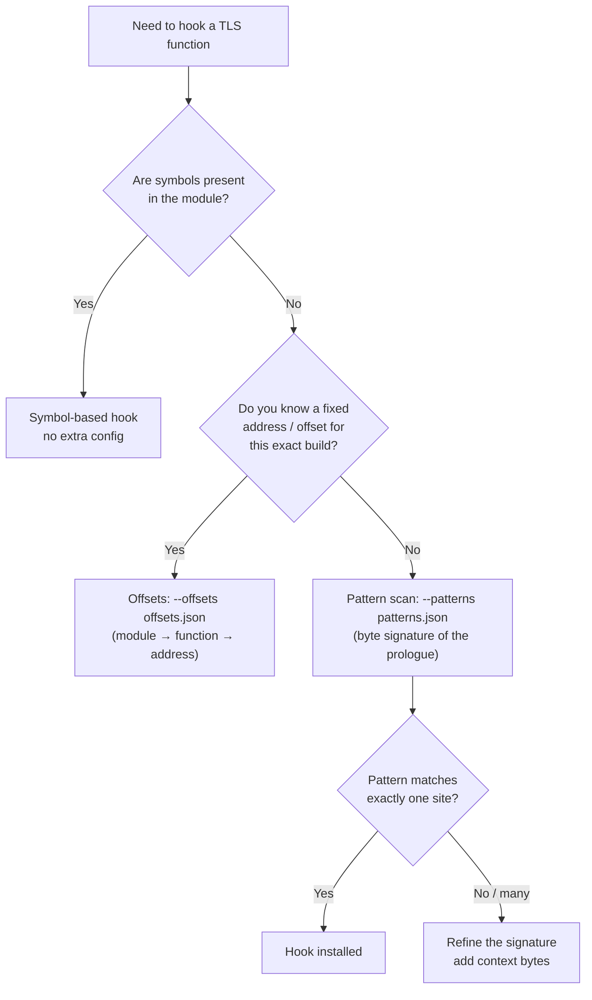

# Pattern-Based Hooking

Pattern-based hooking is one of friTap's most powerful features. It lets you analyze
applications whose SSL/TLS library is **stripped of symbols** or **statically linked**,
where traditional name-based resolution fails.

## What it is and why it exists

friTap normally finds a function such as `SSL_read` by looking up its **symbol** in the
target module's export/symbol table. That works for shared libraries that ship symbols.
It does **not** work when:

- the library is **stripped** (no symbol table), or
- the TLS stack is **statically linked** into another binary (BoringSSL inside Chrome,
  Cronet, or `libflutter.so`), so there is no separate `libssl.so` to resolve against.

!!! note "Explain the why"
    A stripped or statically linked BoringSSL exposes **no symbol** you can hook by name.
    The function still exists in memory — it just has no label. A **byte signature** of
    the function's machine-code prologue becomes the *only* available hook target. That
    is exactly what pattern-based hooking provides: friTap scans the module's executable
    memory for the signature and installs the hook at the matching address.

friTap ships a default pattern database (`friTap/patterns/default_patterns.json`) for
several well-known libraries. Because compilers and library versions change, the shipped
patterns can drift over time, so you can supply your own with `--patterns`.

### Two hooking engines, two pattern schemas

friTap has **two** pattern-based hooking engines, and each expects its own JSON schema. A
`--patterns` file is valid as long as it matches **one** of them — write the schema for the
engine you are targeting:

| Engine | Active when | Schema | Shape | Example file |
|--------|-------------|--------|-------|--------------|
| **Legacy** (`PatternBasedHooking`) | **default** | **Schema B** | `modules → module → platform → arch → function → {primary, fallback, second_fallback?}` | repo-root `pattern.json` |
| **Modern** (`PatternStrategy`) | opt-in via `--modern` | **Schema A** | `library → arch → function → [hex, …]` | `friTap/patterns/default_patterns.json` |

!!! tip "Which schema should I write?"
    The **legacy engine is the default** (the modern engine only runs with `--modern`), and
    it is what the Cronet / Flutter / Android key-extraction hooks use today. So for most
    real targets you write **Schema B** — the object form, exactly like the repo-root
    `pattern.json`. Write **Schema A** (the flat list form) only when you run with
    `--modern`. The loader accepts both, and they can even coexist in one file: Schema B
    lives under the top-level `modules` key while Schema A uses top-level library keys.

### Defaults and merging

- The shipped **default patterns load automatically** — you do not need `--patterns` to
  benefit from them. (`default_patterns.json` is Schema A.)
- When you pass `--patterns <file.json>`, friTap **deep-merges** your file *on top of* the
  defaults. The merge is granular: only the specific leaf entries present in your file
  override the defaults; everything else stays intact. A Schema-B `modules` subtree merges
  in alongside the Schema-A defaults untouched, so the legacy engine sees your patterns and
  the modern defaults remain available.
- If your file is **structurally invalid for both schemas** (wrong nesting or leaf types),
  friTap logs a warning and **falls back to the defaults only** — your file is ignored, but
  the run continues.

## When to use pattern-based hooking

- **Stripped libraries** — no symbol information available.
- **Statically linked SSL** — BoringSSL embedded in Chrome, Cronet, `libflutter.so`.
- **Obfuscated binaries** — anti-analysis protections strip or rename symbols.
- **Custom / proprietary SSL** — modified builds with no recognizable exports.

### Decision tree



## Pattern file format

Write the schema for the engine you are targeting (see the table above). The loader accepts
**both**.

### Schema B — legacy engine (the default)

Nested as **`modules` → module → platform → arch → function → pattern**, where a pattern is
an object `{ "primary": "…", "fallback": "…", "second_fallback": "…" }` (only `primary` is
typically needed; the others are optional). This is the form the repo-root `pattern.json`
uses and the one the default Cronet / Flutter / Android hooks read. The legacy engine scans
`primary`, then `fallback`, then `second_fallback`, stopping at the first match.

```json
{
  "modules": {
    "libcronet.so": {
      "android": {
        "arm64": {
          "Dump-Keys": {
            "primary":  "FF 83 02 D1 FD 7B 05 A9 F9 33 00 F9 F8 5F 07 A9",
            "fallback": "3F 23 03 D5 FF ?3 02 D1 FD 7B 0? A9 F? ?? 0? ?9"
          }
        }
      }
    }
  }
}
```

The platform key is one of `android` / `ios` / `linux` / `macos` / `windows`. Empty strings
are allowed as placeholders (the engine skips them and falls back to symbol hooking).

### Schema A — modern engine (`--modern`)

A flat map **library → arch → function → list of hex strings**. Each function maps to a
**list** of candidate patterns, tried in order. This is the form `default_patterns.json`
uses. The list itself is the primary/fallback chain.

```json
{
  "openssl": {
    "x64": {
      "ssl_log_secret": [
        "55 48 89 E5 48 83 EC 20 48 89 7D F8",
        "55 41 57 41 56 41 54 53 48 83 EC 30 48 8B 47 68"
      ]
    }
  }
}
```

Both examples validate `True` against `friTap.patterns.loader.PatternLoader.validate`. In
Schema A the top-level library key is matched against the **module name** first, then the
library type (`pattern_strategy.ts:74`); the arch key is compared against `Process.arch`,
falling back to `"default"` if present (`pattern_strategy.ts:81-82`).

### Structure hierarchy at a glance

```
Schema B (legacy, default):
modules/<module>/<platform>/<arch>/<function> → { "primary": "<hex>", "fallback": "<hex>" }

Schema A (modern, --modern):
<library>/<arch>/<function> → [ "<hex>", "<hex>", … ]
```

In both, `<arch>` is `x64` / `arm64` / `arm` / `x86` (or `default`), and `<function>` is a
category label such as `ssl_log_secret`, `Dump-Keys`, `SSL_Read`, `SSL_Write`,
`Install-Key-Log-Callback`, `KeyLogCallback-Function`.

### Architecture keys

Use exactly these architecture keys (compared against `Process.arch`):

| Key       | Use for                                |
|-----------|----------------------------------------|
| `x64`     | 64-bit x86 (Intel/AMD)                 |
| `arm64`   | 64-bit ARM (most modern phones)        |
| `arm`     | 32-bit ARM                             |
| `x86`     | 32-bit x86                             |
| `default` | catch-all if no arch-specific entry    |

!!! warning "Do not use `x86_64` or `armv7`"
    Frida's `Process.arch` reports `x64` / `arm64` / `arm` / `x86`. Keys like `x86_64` or
    `armv7` will **never match** and your patterns will be silently skipped.

### Reserved keys

Any top-level key (or arch/function key) that **starts with an underscore** is reserved
and ignored by the validator (`loader.py:92,99,106`). The shipped defaults use this for
documentation:

- `_meta` — version / format metadata.
- `_docs` — category descriptions, architecture list, contributor notes.

You can keep your own `_comment` entries inside a pattern file without breaking validation.

### Hex and wildcard rules

Each pattern string must match the regex `^([0-9A-Fa-f?]{2}\s)*[0-9A-Fa-f?]{2}$`
(`loader.py:84`):

- **Space-separated 2-character tokens**, e.g. `55 48 89 E5`.
- Each token is either two hex digits (`0-9A-Fa-f`) or wildcards.
- `?` and `??` **wildcards are allowed mid-pattern** for variable bytes (registers,
  immediates, padding, compiler-specific differences). A nibble wildcard like `E?` is also
  valid (the token stays 2 characters).

!!! warning "Avoid leading/trailing `??`"
    Do not begin or end a pattern with `??`. Frida's scanner rejects patterns whose edges
    are fully wildcarded. Always anchor the signature with concrete bytes at both ends.

## `--patterns` vs `--offsets` — two separate mechanisms

These are **different** features and must not be mixed in one file:

| Feature      | Flag         | File shape                                        | Use when                                  |
|--------------|--------------|---------------------------------------------------|-------------------------------------------|
| Byte scanning| `--patterns` | Schema B `modules → … → {primary, fallback}` (default) or Schema A `library → arch → function → [hex]` (`--modern`) | You have a signature but no fixed address |
| Offsets      | `--offsets`  | `module → function → {address, absolute}`         | You know the exact address/offset already |

**Offsets file** (`offsets_example.json`):

```json
{
  "openssl": {
    "SSL_read":  { "address": "0x572115b4", "absolute": true },
    "SSL_write": { "address": "0x144c",     "absolute": false }
  }
}
```

`absolute: true` means a runtime virtual address; `absolute: false` means an offset from
the module base. Offsets skip scanning entirely — friTap hooks the computed address
directly.

## Create a pattern (step-by-step)

This tutorial is **tool-agnostic** for the prologue extraction, then shows how a
BoringSecretHunter line drops straight into one list entry.

### Step 1 — Locate the target function

Use any disassembler (radare2, Ghidra, IDA, objdump). The most valuable target for TLS key
extraction is `ssl_log_secret` (BoringSSL/OpenSSL), which is **always called during the
handshake**, even when key logging is disabled.

```bash
# radare2 example
r2 -A libflutter.so
[0x00000000]> afl | grep -i ssl
[0x00000000]> pdf @ sym.ssl_log_secret
```

### Step 2 — Read the prologue bytes

Dump the first ~32-48 bytes of the function. A typical x64 prologue:

```assembly
push rbp           ; 55
mov  rbp, rsp      ; 48 89 E5
sub  rsp, 0x20     ; 48 83 EC 20
mov  [rbp-8], rdi  ; 48 89 7D F8
```

This becomes the pattern token sequence: `55 48 89 E5 48 83 EC 20 48 89 7D F8`.

### Step 3 — Wildcard the volatile bytes

Replace bytes that vary across builds (relative offsets, immediates, some registers) with
`?`/`??`, but keep concrete bytes at the start and end:

```
55 48 89 E5 ?? ?? ?? ?? 48 83 EC ?? 48 89 7D F8
```

### Step 4 — Drop it into the schema for your engine

For the **default (legacy) engine**, use Schema B — put the signature in `primary` under
`modules → module → platform → arch → function`:

```json
{
  "modules": {
    "libflutter.so": {
      "android": {
        "arm64": {
          "Dump-Keys": { "primary": "55 48 89 E5 ?? ?? ?? ?? 48 83 EC ?? 48 89 7D F8" }
        }
      }
    }
  }
}
```

If you run with `--modern`, use Schema A instead — the same signature as one element of a
list: `{ "libflutter": { "arm64": { "ssl_log_secret": ["55 48 89 E5 ?? ?? ?? ?? 48 83 EC ?? 48 89 7D F8"] } } }`.

!!! note "Function label naming"
    Use the label friTap expects for the strategy you are extending. The shipped defaults
    use `ssl_log_secret` for OpenSSL/BoringSSL key dumping; the `_docs` block lists the
    category labels (`Dump-Keys`, `SSL_Read`, `SSL_Write`, `Install-Key-Log-Callback`,
    `KeyLogCallback-Function`).

### Automating with BoringSecretHunter

[BoringSecretHunter](https://github.com/monkeywave/BoringSecretHunter) is a Ghidra-based
tool that locates `ssl_log_secret()` in stripped BoringSSL/rustls libraries and emits a
ready-to-use Frida byte pattern.

```bash
git clone https://github.com/monkeywave/BoringSecretHunter.git
cd BoringSecretHunter
docker build -t boringsecrethunter .

mkdir -p binary results
cp /path/to/libsignal_jni.so binary/

docker run --rm \
  -v "$(pwd)/binary":/usr/local/src/binaries \
  -v "$(pwd)/results":/host_output \
  -e DEBUG_RUN=true \
  boringsecrethunter
```

**Example output:**

```
[*] Start analyzing binary libsignal_jni.so (CPU Architecture: AARCH64)...
[*] Target function identified (ssl_log_secret):

Function label: FUN_00493BB0
Function offset: 00493BB0 (0X493BB0)
Byte pattern for frida (friTap): 3F 23 03 D5 FF C3 01 D1 FD 7B 04 A9 F6 57 05 A9 F4 4F 06 A9 FD 03 01 91 08 34 40 F9 08 11 41 F9 C8 07 00 B4
```

The "Byte pattern for frida (friTap)" line drops in with no reformatting. For the default
(legacy) engine, place it in `primary` (Schema B):

```json
{
  "modules": {
    "libsignal_jni.so": {
      "android": {
        "arm64": {
          "Dump-Keys": { "primary": "3F 23 03 D5 FF C3 01 D1 FD 7B 04 A9 F6 57 05 A9 F4 4F 06 A9 FD 03 01 91 08 34 40 F9 08 11 41 F9 C8 07 00 B4" }
        }
      }
    }
  }
}
```

Under `--modern`, drop the same string into a Schema-A list instead:
`{ "libsignal_jni": { "arm64": { "ssl_log_secret": ["3F 23 03 D5 …"] } } }`.

!!! tip "Why Docker?"
    The Docker image bundles a pre-configured Ghidra, eliminating setup and giving
    consistent extraction across platforms.

### Validate before you deploy

Catch format mistakes early without a device:

```bash
# Quick JSON sanity check
python -m json.tool signal_pattern.json

# Validate against the actual loader (prints True on success)
python -c "import json, logging; from friTap.patterns.loader import PatternLoader; \
print(PatternLoader.validate(json.load(open('signal_pattern.json')), logging.getLogger('t')))"
```

## Gotchas

!!! note "Scans executable (r-x) ranges, with a whole-module fallback"
    The scanner enumerates the module's **r-x ranges** and scans those, because function
    prologues always live in executable memory and a single scan over the whole
    `[base, base+size]` span can hit unreadable pages and throw an access violation on
    huge modules (e.g. Chrome's ~193 MB `libmonochrome_64.so`). If range enumeration
    yields nothing, it falls back to a whole-module scan (`pattern_strategy.ts:139-158`).

!!! warning "Ambiguous match → first hit + warning"
    If a pattern matches **more than one site**, friTap installs the hook at the **first**
    match and emits a warning (`pattern_strategy.ts:45-53`). A wrong first hit can land on
    a hot path and slow or hang the process. Make your signature longer/more specific if
    you see this warning.

!!! warning "No-match falls through silently"
    If no pattern matches, the pattern strategy simply reports failure for that function
    and the pipeline continues — there is **no hard error**. Run with `-do`
    (debug output) to see per-pattern scan diagnostics, otherwise a missing hook can look
    like "nothing happened".

## Using pattern files on the CLI

```bash
# Use a pattern file for key extraction (deep-merged on top of defaults)
fritap --patterns patterns.json -k keys.log target_app

# Mobile target
fritap -m --patterns android_patterns.json -k keys.log com.example.app

# See what matched / why it did not (debug output)
fritap -do -v --patterns patterns.json target_app

# Use fixed addresses instead of scanning
fritap --offsets offsets.json -k keys.log target_app

# Force a full library scan (do not trust cached/known module lists)
fritap --force-scan --patterns patterns.json -k keys.log target_app
```

| Flag          | Purpose                                                                 |
|---------------|-------------------------------------------------------------------------|
| `--patterns`  | Supply byte signatures (deep-merged on top of shipped defaults).        |
| `--offsets`   | Supply fixed addresses/offsets (separate from `--patterns`).            |
| `--force-scan`| Force a fresh library scan instead of relying on known module lists.    |
| `-do`         | Emit debug output, including per-pattern scan diagnostics.              |

## Real-world examples

### Flutter applications

Flutter statically links BoringSSL into `libflutter.so`. Flutter key extraction runs on the
default (legacy) engine, so use **Schema B** (`primary`/`fallback` under `modules`):

```json
{
  "modules": {
    "libflutter.so": {
      "android": {
        "arm64": {
          "Dump-Keys": {
            "primary":  "FF 83 00 D1 FD 7B 01 A9 ?? ?? ?? ?? F4 4F 03 A9",
            "fallback": "FF 83 00 D1 FD 7B 01 A9 F4 4F 03 A9"
          }
        }
      }
    }
  }
}
```

```bash
fritap -m --patterns flutter_patterns.json -k flutter_keys.log com.example.flutter_app
```

### Cronet applications

Chrome's Cronet (Google QUICHE / BoringSSL) is the canonical pattern target. Two cases:

- **BoringSSL key dump** (default/legacy engine) — use **Schema B**, exactly like the
  `libcronet.so` example earlier in this page (`modules → libcronet.so → android → arch →
  Dump-Keys → {primary, fallback}`).
- **QUICHE HTTP/3 stream patterns** — the shipped defaults already carry runtime-verified
  arm64 QUICHE patterns under the `google_quiche` library key in **Schema A** (the form
  `default_patterns.json` uses). Override per build with your own Schema-A file:

```json
{
  "google_quiche": {
    "arm64": {
      "QuicSpdyStream_OnDataFramePayload": [
        "3F 23 03 D5 FD 7B BF A9 FD 03 00 91 08 04 40 F9 00 ?? ?? 91 ?? ?? ?? ?? 20 00 80 52 FD 7B C1 A8 BF 23 03 D5 C0 03 5F D6"
      ]
    }
  }
}
```

```bash
fritap -m --patterns cronet_patterns.json -k cronet_keys.log com.google.android.gms
```

## Troubleshooting

**Pattern not found**

```bash
# Verify JSON + schema first
python -m json.tool patterns.json

# See per-pattern scan diagnostics
fritap -do --patterns patterns.json -v target_app

# Confirm the library is actually loaded / named as you expect
fritap --list-libraries target_app
```

If the run is silent, the most common causes are: wrong architecture key
(`x86_64`/`armv7` instead of `x64`/`arm64`), using the **wrong schema for the active
engine** (a Schema-A flat list while on the default legacy engine, or a Schema-B `modules`
object while on `--modern`), or a leading/trailing `??`.

**False positives / ambiguous-match warning**

Add more concrete context bytes to make the signature unique — the scanner warns when a
pattern hits multiple sites and installs at the first one.

**Pattern worked on one build, fails on the next**

Re-extract with BoringSecretHunter for the new build, or widen the volatile mid-pattern
bytes with wildcards while keeping the edges concrete.

## Next steps

- **[Add a new library / hook](../development/adding-features.md)** — how the hooking
  pipeline and strategies fit together.
- **[CLI reference](../api/cli.md)** — full documentation for `--patterns`, `--offsets`,
  `--force-scan`, `-do`, and related flags.
