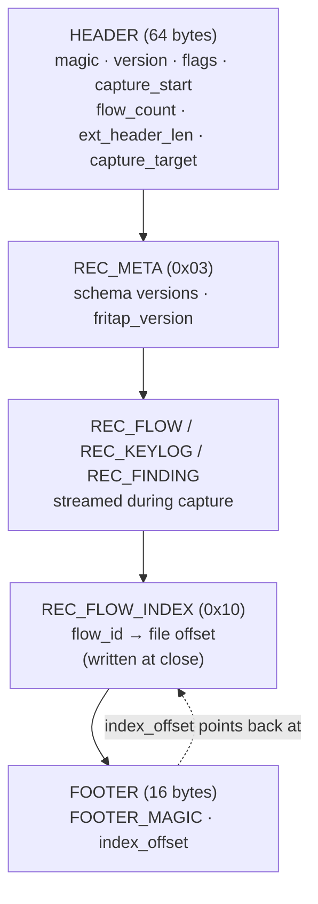

# The `.tap` file format

The `.tap` format is friTap's on-disk container for flow captures. It stores
decrypted flows, TLS keylog material, file-level metadata, and analysis findings
in a single binary file that can be replayed in the [TUI](../getting-started/tui.md),
read programmatically with [`TapReader`](#reading-with-tapreader), or produced
offline from a pcap with [`pcap_to_tap()`](../advanced/offline-pcap-to-tap.md).

This page is the **canonical reference** for the format's magic values, struct
layouts, record types, and version semantics. Other pages link here rather than
restating the constants.

!!! info "Source of truth"
    Every constant and struct on this page is taken verbatim from
    `friTap/flow/tap_format.py`. The reading behaviour is implemented in
    `friTap/flow/tap_reader.py`. If the source and this page ever disagree, the
    source wins — please file an issue.

---

## Overview & when to use

A `.tap` file is a binary envelope of **JSON metadata plus raw binary blobs**,
one record per event. Unlike a pcap/pcapng, a `.tap` file stores friTap's
*reconstructed* view of traffic: flows with their HTTP request/response parse
results, protocol layer stacks, TLS enrichment, and any analysis findings —
already decrypted.

Reach for `.tap` when you want to:

- **Replay** a capture offline in the TUI (`fritap capture.tap`) without
  re-running the target.
- **Analyze** traffic after the fact (`fritap analyze capture.tap`, see
  [traffic analysis](../advanced/traffic-analysis.md)).
- **Convert** an existing pcap + keylog into friTap's flow model with
  [`--from-pcap`](../advanced/offline-pcap-to-tap.md).
- **Read flows programmatically** via the [Python API](python.md).

If you only need wire-level packets for Wireshark, use friTap's `--pcap`/`--pcapng`
output instead. `.tap` is friTap's higher-level, flow-centric format.

---

## File layout

A `.tap` file is written in this order: a fixed 64-byte header, a stream of
records (the META record first, then FLOW / KEYLOG / FINDING records as the
capture runs), an optional FLOW_INDEX record written at close, and finally a
fixed 16-byte footer pointing back at the index.



Every record (including META, the FLOW_INDEX, and findings) is wrapped in the
same 16-byte [record envelope](#record-envelope-crc32) with a sync marker and a
CRC32 over its payload.

---

## Header

The header is a fixed **64-byte** little-endian struct, optionally followed by a
variable-length JSON *extension* block (`ext_header_len` bytes).

Struct format: `<4sHHdII8s32s` (`_HEADER_STRUCT`, asserted to be 64 bytes).

| Field            | Type        | Bytes | Meaning |
|------------------|-------------|-------|---------|
| `magic`          | `4s`        | 4     | `MAGIC = b"TAP\x01"` — identifies the file and pins the container generation. |
| `version`        | `H` (u16)   | 2     | `FORMAT_VERSION` the file was written with (currently `1`). |
| `flags`          | `H` (u16)   | 2     | Bitfield — see [flags](#header-flags). |
| `capture_start`  | `d` (double)| 8     | Unix epoch seconds when the capture began. |
| `flow_count`     | `I` (u32)   | 4     | Number of flows recorded (best-effort; the index is authoritative). |
| `ext_header_len` | `I` (u32)   | 4     | Length in bytes of the JSON extension block that follows the fixed header (`0` if none). |
| *reserved*       | `8s`        | 8     | 8 reserved zero bytes for future fixed-width fields. |
| `capture_target` | `32s`       | 32    | UTF-8 capture target (package/process/pcap name), null-padded, truncated at a Unicode boundary to fit 32 bytes. |

When `ext_header_len > 0`, the reader parses the following JSON object into
`TapHeader.ext_data`. The total header size returned by `decode_header()` is
`64 + ext_header_len`.

### Header flags

| Flag                | Value    | Meaning |
|---------------------|----------|---------|
| `FLAG_HAS_INDEX`    | `0x0001` | A FLOW_INDEX record was written and the footer points at it (file was closed cleanly). |
| `FLAG_HAS_FINDINGS` | `0x0002` | At least one `REC_FINDING` record was written. Lets a reader decide (header-only) whether a findings scan is worthwhile. |

!!! note "Additive flag semantics"
    `FLAG_HAS_FINDINGS` is additive: old files predate it, so its *absence* means
    "unknown", not "no findings". The reader treats a footer-indexed file without
    the flag as provably findings-free, but falls back to a lazy scan when
    presence is undetermined.

---

## Record envelope & CRC32

Every record is prefixed by a fixed **16-byte** little-endian envelope.

Struct format: `<4sBBHII` (`_RECORD_ENVELOPE`, asserted to be 16 bytes).

| Field         | Type      | Bytes | Meaning |
|---------------|-----------|-------|---------|
| `sync`        | `4s`      | 4     | `SYNC_MARKER = b"\xF7\xA9\x00\x00"` — boundary marker for [corruption recovery](#corruption-recovery). |
| `type`        | `B` (u8)  | 1     | Record type — see [record types](#record-types). |
| *reserved*    | `B` (u8)  | 1     | Reserved byte (written as `0`). |
| *reserved*    | `H` (u16) | 2     | Reserved 16-bit field (written as `0`). |
| `payload_len` | `I` (u32) | 4     | Length of the payload that follows the envelope. |
| `crc32`       | `I` (u32) | 4     | CRC32 of the payload. |

The CRC is computed over the payload only:

```python
crc = zlib.crc32(payload) & 0xFFFFFFFF
```

On read, `verify_payload_crc()` recomputes the CRC and compares. A mismatch
causes that record to be skipped (logged), but never aborts the whole read —
other records remain usable.

---

## Record types

The 1-byte `type` field selects the payload shape:

| Constant         | Value  | Payload |
|------------------|--------|---------|
| `REC_FLOW`       | `0x01` | A single flow: length-prefixed JSON metadata + concatenated binary blobs. See [FLOW record body](#flow-record-body-de-duplication). |
| `REC_KEYLOG`     | `0x02` | JSON `{"key_data", "timestamp"}` — one SSLKEYLOGFILE line + its timestamp. |
| `REC_META`       | `0x03` | JSON file-level metadata (`schema_version`, `flow_fields_version`, `parse_result_version`, `fritap_version`). Written first. |
| `REC_FINDING`    | `0x04` | JSON `{"flow_id", "findings": [...]}` — analysis findings bound to a flow. See [the caveat](#flow-record-body-de-duplication). |
| `REC_FLOW_INDEX` | `0x10` | JSON `{"version", "entries": [{"flow_id", "offset"}]}` — written at close so readers can seek directly to each flow. |

---

## FLOW record body & de-duplication

A FLOW record payload is laid out as:

```
[json_meta_len (4 bytes LE)] [json_meta bytes] [blob bytes]
```

The JSON metadata holds flow scalars, the chunk list, request/response parse
results, optional enrichment, and (schema v3) the protocol layer stack. Binary
data — chunk bytes, request/response bodies, owned inner-layer bytes — lives in
the trailing blob section and is **never inlined**. Each kind of payload is
referenced from the JSON by its own offset/length field names, not a single
generic `blob_offset`/`blob_len` pair:

| Binary payload                | JSON fields (offset / length) |
|-------------------------------|-------------------------------|
| Per-chunk data                | `blob_offset` / `blob_len` |
| Request/response bodies       | `body_blob_offset` / `body_blob_len` |
| Trailing data                 | `trailing_blob_offset` / `trailing_blob_len` |
| Owned inner-layer bytes       | `data_owned` object: `r_off` / `r_len` (read) and `w_off` / `w_len` (write) |

!!! warning "Bodies are de-duplicated — `pr.body` may be empty on read"
    To avoid storing a body twice (once as raw chunks, once as a reconstructed
    blob), `_encode_parse_result` sets `body_from_chunks = True` and stores **no
    body blob** when a request/response `pr.body` is empty but the bytes are
    recoverable from `flow.chunks`.

    On read, such a `ParseResult` comes back with an **empty `pr.body`** and
    `pr.body_from_chunks == True`. The real body is reconstructed on demand via
    `Flow.request_body` / `Flow.response_body` (which fall back to the chunks).
    Bodies that are *not* recoverable from chunks (e.g. WebSocket payloads, OHTTP
    inner messages, trailing data) are still stored as blobs as before.

!!! danger "Findings are NOT inline in FLOW records"
    Analysis findings are deliberately **not** embedded in the FLOW payload. They
    are persisted as separate `REC_FINDING` records keyed by `flow_id`. This keeps
    the summary fast path (`decode_flow_summary`) lean — it never has to parse
    findings. A reader rebuilds the `flow_id → [Finding]` mapping lazily from the
    `REC_FINDING` records and attaches them when you load a full flow. Do not look
    for a `findings` key inside a FLOW record.

---

## Flow index & footer

When a capture closes cleanly, friTap writes a `REC_FLOW_INDEX` record mapping
each `flow_id` to the byte offset of its FLOW record envelope, then a fixed
**16-byte** footer.

Footer struct format: `<8sQ` (`_FOOTER_STRUCT`, asserted to be 16 bytes).

| Field          | Type      | Bytes | Meaning |
|----------------|-----------|-------|---------|
| `footer_magic` | `8s`      | 8     | `FOOTER_MAGIC = b"TAP_END\x00"` — distinct from the header magic so truncation is detectable. |
| `index_offset` | `Q` (u64) | 8     | Absolute file offset of the FLOW_INDEX record envelope. |

The reader reads the last 16 bytes, validates `FOOTER_MAGIC`, seeks to
`index_offset`, and loads the index — an O(1) open even for huge captures. If the
footer magic is wrong, the index record is missing, or `FLAG_HAS_INDEX` is unset
(a partial/crashed capture), the reader falls back to a full linear scan.

---

## Versioning

There are **two independent version numbers**, both additive:

| Constant              | Where          | Current | Meaning |
|-----------------------|----------------|---------|---------|
| `FORMAT_VERSION`      | header `version` | `1`   | The binary container generation (header/envelope/footer struct shapes). |
| `FLOW_SCHEMA_VERSION` | each FLOW's JSON `_v` | `3` | The FLOW JSON metadata schema (which enrichment keys / layer stack are present). |

- **`FORMAT_VERSION`** governs the binary framing. If a file's header
  `version` is **greater than** the reader's `FORMAT_VERSION`,
  `decode_header()` raises `ValueError` ("Format version N is newer than
  supported … Please update friTap"). Equal or lower versions are accepted.

- **`FLOW_SCHEMA_VERSION`** is stamped into each FLOW record's JSON as `_v` and
  resolved per-flow by `resolve_flow_schema_version()`. Records with no `_v` are
  treated as schema version 1. The schema is **additive across versions**:
  v2 added optional enrichment keys (`tls`, `tags`, `notes`, local/remote
  addresses, `process_name`, `hook_*`) and the `body_from_chunks` de-dup flag;
  v3 added the ordered protocol `layers` stack. Readers use `.get(...)` with
  defaults, so v1, v2, and v3 FLOW records all decode correctly — older fields
  remain the source of truth and newer layers mirror them.

!!! tip "Forward compatibility rule of thumb"
    A newer **flow schema** in an old reader degrades gracefully (unknown keys
    ignored). A newer **format version** is a hard stop — upgrade friTap.

---

## Reading with `TapReader`

`TapReader` (in `friTap.flow.tap_reader`, re-exported as `friTap.TapReader`)
provides two-tier loading: fast metadata-only summaries for a flow list, plus
on-demand full-flow loads with chunks and bodies.

| Method                       | Returns         | Notes |
|------------------------------|-----------------|-------|
| `open()`                     | `TapMeta`       | Parses the header, reads META, builds the flow index (footer or linear scan). |
| `read_flow_summaries()`      | `list[FlowSummary]` | Fast, metadata only, sorted by start time. |
| `read_flow(flow_id)`         | `Flow \| None`  | Full load (chunks, bodies, findings) for one flow. |
| `read_all_flows()`           | `list[Flow]`    | Full load of every flow (prefer summaries + on-demand for large files). |
| `read_findings(flow_id)`     | `list[Finding]` | Findings from `REC_FINDING` records (lazy index). |
| `has_findings()`             | `bool`          | Cheap presence check. |
| `close()`                    | `None`          | Safe to call repeatedly; also a context manager. |

```python title="Reading a .tap file (offline / CI-runnable)"
from friTap import TapReader

reader = TapReader("capture_20260507_153933.tap")
meta = reader.open()                       # -> TapMeta
summaries = reader.read_flow_summaries()   # fast, no chunks/bodies
print(len(summaries))                      # number of flows

# Load one full flow on demand (chunks, bodies, findings)
if summaries:
    flow = reader.read_flow(summaries[0].flow_id)
    print(flow.dst_addr, flow.dst_port)

reader.close()
```

Run against the committed sample capture, this prints **`276`** — the number of
flows in `capture_20260507_153933.tap`:

```console
$ ./env/bin/python -c "from friTap import TapReader; \
    r=TapReader('capture_20260507_153933.tap'); m=r.open(); \
    s=r.read_flow_summaries(); print(len(s)); r.close()"
276
```

`TapReader` is also usable as a context manager:

```python
with TapReader("capture_20260507_153933.tap") as reader:
    for summary in reader.read_flow_summaries():
        print(summary.flow_id, summary.protocol, summary.host)
```

---

## Corruption recovery

The sync marker (`SYNC_MARKER = b"\xF7\xA9\x00\x00"`) at the start of every record
envelope lets the reader recover from a corrupt or partially written file. If the
envelope at the current position fails to validate (bad sync marker), the reader
scans forward in 4 KB chunks for the next `SYNC_MARKER` (`find_sync_marker()`) and
resumes from there, skipping the damaged region.

This recovery, combined with the per-record CRC32, means a `.tap` file that was
truncated mid-write (e.g. a crashed capture with no footer) is still partially
readable:

- A missing/invalid footer or absent `FLAG_HAS_INDEX` triggers a **linear scan**
  that rebuilds the flow index by walking every record.
- Records with a CRC mismatch or undecodable payload are **skipped** (logged at
  debug level), not fatal.
- A truncated payload at EOF simply ends the scan.

!!! tip "Partial captures still open"
    Because the index is optional and the scan is sync-marker driven, a capture
    interrupted before `close()` still yields all the flows that were fully
    written — you do not lose the whole file to one bad record.

---

## Next steps

- [Offline pcap → .tap conversion](../advanced/offline-pcap-to-tap.md) — produce a
  `.tap` from an existing pcap + keylog.
- [Traffic analysis](../advanced/traffic-analysis.md) — run analyzers over a `.tap`
  and understand `REC_FINDING` records.
- [Python API](python.md) — the full `TapReader` / `ReplayController` / flow model
  surface.
