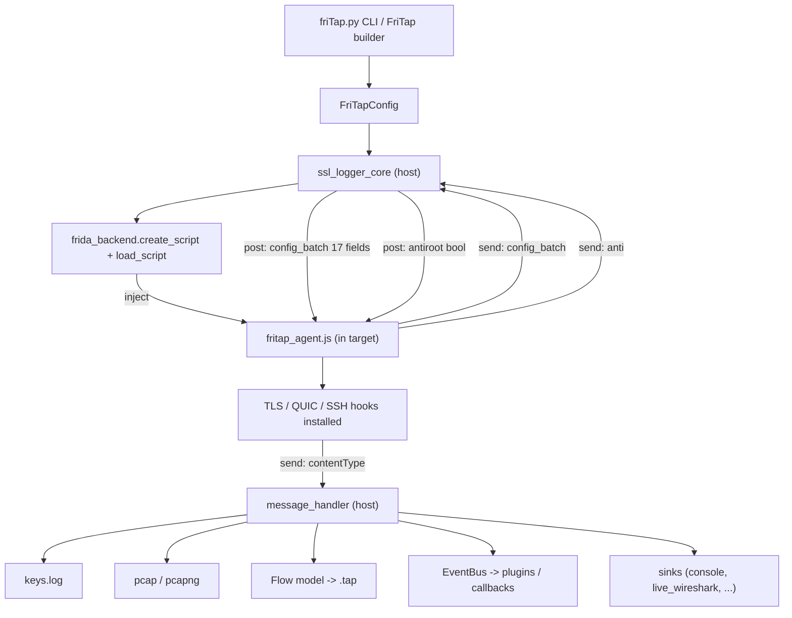

# Architecture

This page describes how friTap works internally: how the Python CLI drives a
compiled Frida agent, how the two sides exchange configuration and captured
data over the Frida message channel, and how a built agent is produced from the
TypeScript sources.

!!! info "This page owns the wire-level protocol"
    The `config_batch` handshake and the outgoing `contentType` schema, together
    with the build/compile pipeline, are defined **here**. Other pages
    ([Concepts](../getting-started/concepts.md),
    [Standalone Agent](../advanced/standalone-agent.md)) link to this page rather
    than restating the protocol. If you change a field or message, update this
    page and the source it cites.

## End-to-end overview

friTap is two cooperating halves joined by Frida's bidirectional message channel:

- **Python host** — the CLI (`friTap/friTap.py`) parses flags into a
  `FriTapConfig` (`friTap/config.py`), which the legacy core
  (`friTap/legacy/ssl_logger_core.py`) consumes. A backend
  (`friTap/backends/frida_backend.py`) attaches to or spawns the target process.
- **Frida agent** — a single compiled JavaScript file (`friTap/fritap_agent.js`)
  is injected into the target. It installs the TLS/QUIC/SSH hooks and sends
  captured material back to the host.

The lifecycle is:

1. **CLI → config.** `friTap.py` builds a `FriTapConfig`. The core reads the
   compiled agent from disk: `get_agent_script()` opens
   `os.path.join(here, "fritap_agent.js")`
   (`friTap/legacy/ssl_logger_core.py:1561-1563`; `here` is the package root,
   line 48).
2. **Backend injects the agent.** `create_script(...)` compiles the agent into
   the target and `load_script(...)` runs it
   (`frida_backend.py:351-356`; called from `ssl_logger_core.py:789,799`).
3. **Agent requests config.** Immediately on load the agent issues a single
   handshake: `send("config_batch")` and blocks on the reply
   (`agent/fritap_agent.ts:222-223`, via `recvHandshake`, `:211-220`).
4. **Host replies once.** The host's message handler sees the `"config_batch"`
   string payload, assembles the 17-field batch, and posts it back via
   `post_message(...)` (`ssl_logger_core.py:614-654`;
   `frida_backend.py:369-370` → `script.post(...)`).
5. **Anti-root probe (Android).** After the batch the agent runs one more
   handshake — `anti` → `antiroot` — then initializes the hooking pipeline
   (`agent/fritap_agent.ts:256-260`).
6. **Hooks install, capture begins.** The agent loads the OS-specific hooking
   agent (`agent/fritap_agent.ts:287+`) and installs key-extraction / plaintext
   hooks.
7. **Agent → host messages.** Each hook emits a `send(...)` whose payload carries
   a `contentType` discriminator (keys, plaintext, lifecycle, console, etc.).
8. **Host handlers fan out.** `_message_callback` dispatches by `contentType`
   to the keylog file, pcap/pcapng writers, the Flow model and `.tap` writer,
   the event bus, and any active [sinks](#sinks)
   (`ssl_logger_core.py:659-663`, `friTap/legacy/message_handler.py`).

## Data-flow diagram



## The `config_batch` handshake

The agent sends the literal string `"config_batch"` and waits. The host builds a
dictionary and posts it back **once** — replacing the deprecated
per-field handshake. Every field is applied with `??` (nullish-coalescing), so
an omitted field falls back to the agent default.

- **Agent consumer:** `agent/fritap_agent.ts:223-254`
- **Host producer:** `friTap/legacy/ssl_logger_core.py:616-654`

| # | Field | Purpose |
|---|-------|---------|
| 1 | `offsets` | User-supplied symbol offsets (`--offsets`) for hooking without symbols. |
| 2 | `patterns` | Byte-pattern JSON string (`--patterns`); parsed once at the agent boundary. |
| 3 | `socket_tracing` | Enable the socket tracer (emits `netlog`). |
| 4 | `defaultFD` | Install the default-FD fallback so reads/writes without a tracked socket still log. |
| 5 | `pcap_enabled` | Install plaintext read/write hooks — `bool(pcap_name) and not full_capture`. |
| 6 | `keylog_enabled` | Install key-extraction hooks — `bool(keylog)`; gates KeylogEvents/scan budget. |
| 7 | `experimental` | Enable experimental hooks/paths (`-x`). |
| 8 | `protocol_select` | Selected protocol (`tls`/`ssh`/`ipsec`); drives `setSelectedProtocol`. |
| 9 | `install_lsass_hook` | Windows: hook LSASS/Schannel for the SSP keys. |
| 10 | `use_modern` | Use the modern HookDefinition pipeline (`--modern`, EXPERIMENTAL). |
| 11 | `library_scan` | Pre-computed library-scan results passed in from the host. |
| 12 | `library_scan_enabled` | Whether the agent should perform its own library scan. |
| 13 | `ohttp_enabled` | Enable OHTTP (NSS HPKE) inner-payload capture (within `--protocol tls`). |
| 14 | `quic_capture_mode` | `"stream"` or `"app-api"` — where HTTP/3 is captured. |
| 15 | `quic_only` | Capture only QUIC, skipping TCP/TLS hooks. |
| 16 | `quic_egress_headers_layer` | Force the HTTP/3 egress-headers chain layer (`"auto"` = winner-takes-all). |
| 17 | `debug_output` | Mirror of `-do`/`--debugoutput`; lets the agent skip expensive debug-only enumeration. |

!!! warning "Keep integrators in sync"
    A standalone integrator must send all 17 fields. Omitting `keylog_enabled`
    (defaults true in the agent) or `debug_output` causes subtle behavior drift.
    See [Standalone Agent](../advanced/standalone-agent.md).

## Outgoing `contentType` messages

After hooks install, the agent reports everything as a `send(...)` whose payload
contains a `contentType` discriminator. The host dispatches on it
(`ssl_logger_core.py:659-663`; `friTap/legacy/message_handler.py`).

!!! info "The TypeScript schema is generated — edit the Python source"
    `agent/schemas/messages.ts` is **auto-generated** from
    `friTap/schemas/agent_messages.py` by `dev/generate_agent_types.py`
    (the file header says *"Do NOT edit by hand"*). To add or change a message,
    edit the Pydantic models in `agent_messages.py`, then run
    `python dev/generate_agent_types.py` and `npm run build`.

| `contentType` | Payload (key fields) | Host destination |
|---------------|----------------------|------------------|
| `keylog` | `keylog` (one keylog line) | `keys.log` + `KeylogEvent` |
| `datalog` | direction, addrs/ports, `ss_family`, session id, `client_random`, QUIC ids, HTTP/3 headers | plaintext pcap / Flow / `DatalogEvent` |
| `connection_lifecycle` | `event` (`created`/`destroyed`/`stream_fin`), session id, addrs | `SessionEvent` / flow lifecycle |
| `library_detected` | `library`, `message`, `path` | `LibraryDetectedEvent` |
| `console` | `console` (text) | console sink (`log()` helper) |
| `console_dev` | `console_dev` (text) | developer console (`devlog()` helper) |
| `console_debug` | `message`, `level="debug"`, `time` | leveled console |
| `console_info` | `message`, `level="info"`, `time` | leveled console |
| `console_warn` | `message`, `level="warn"`, `time` | leveled console |
| `console_error` | `message`, `level="error"`, `time` | leveled console |
| `netlog` | function, addrs/ports, `ss_family` | socket-trace / `SocketTraceEvent` |
| `ssh_newkeys` | `direction`, `message`, `protocol="ssh"` | SSH key extraction |
| `ssh_key` | `direction`, `key_type`, `cipher`, `key_data` | SSH key extraction |
| `ssh_keylog` | `cookie` + key material | SSH keylog file |
| `ipsec_child_sa_keys` | `keys` dict (`encr_i`/`encr_r`/`integ_*`) | IPsec key extraction **(EXPERIMENTAL)** |
| `ipsec_ike_keys` | `keys` dict (`SK_ai`/`SK_ar`/`SK_ei`/…) | IPsec key extraction **(EXPERIMENTAL)** |
| `ohttp_plaintext` | `direction`, `source`, bhttp payload (binary 2nd arg) | OHTTP decrypted inner payload |

!!! warning "IPsec is detection/extraction-stub only"
    `ipsec_child_sa_keys` and `ipsec_ike_keys` are **EXPERIMENTAL**. The Linux
    strongSwan/libcharon hooks (`agent/ipsec/platforms/linux/ipsec_linux.ts`)
    are present but key extraction is not production-ready.

## Anti-root probe

The only remaining per-message handshake (besides `config_batch`) is the
anti-root probe. After delivering the config batch the agent sends `anti` and
waits for the reply on channel `antiroot`
(`agent/fritap_agent.ts:257`, via `recvHandshake("anti", anti_root, "antiroot")`).

The host replies with `{ type: "antiroot", payload: <bool> }` (the `--anti-root`
flag). When `true` on Android, the agent applies its root-detection bypass before
loading hooks (`agent/fritap_agent.ts:302-305`). This handshake is **last** in the
startup sequence to avoid a deadlock.

## Sinks

Sinks are host-side consumers of canonical capture events. They live in
`friTap/sinks/`:

- `console.py` — terminal output.
- `keylog.py` — writes the keylog file.
- `pcap.py` / `pcapng.py` — packet writers.
- `json_sink.py` — structured JSON output.
- `live_pcapng.py` — live pcapng FIFO.
- **`live_wireshark.py`** — `LiveWiresharkSink` backs **TUI capture mode 5**
  (`live_pcapng`, Unix). It creates a named FIFO
  (`create_fifo()` → `os.mkfifo`, `live_wireshark.py:42-46`) that Wireshark reads
  while friTap streams decrypted pcapng into it. It implements `on_keylog`,
  `on_data`, `on_meta`, `flush`, and `close` over the FIFO.
- `tcp_state.py` — TCP reassembly state for synthetic packet generation.

## Build / compile

The agent is TypeScript (`agent/`) compiled to a single bundled JavaScript file:

```bash
npm run build
# → frida-compile agent/fritap_agent.ts -o friTap/fritap_agent.js
```

(`package.json:9`; a `watch` variant exists at `:10`.) The output
`friTap/fritap_agent.js` ships inside the Python package.

At runtime the host loads the **compiled** JS (never the TypeScript): the core
opens `friTap/fritap_agent.js` with `open(..., newline='\n')` and reads it as a
string (`get_agent_script()`, `ssl_logger_core.py:1561-1563`), then hands that
string to `backend.create_script(...)` for injection.

!!! tip "After editing the agent"
    Always run `npm run build` so `friTap/fritap_agent.js` reflects your
    TypeScript changes. If you touched the message schema, also regenerate
    `agent/schemas/messages.ts` first
    (`python dev/generate_agent_types.py`). See
    [Adding Features](adding-features.md).

## Worked example: tracing one keylog line

Follow a single OpenSSL/BoringSSL keylog line from the hook to `keys.log`:

1. **Agent hook fires.** The OpenSSL definition hooks
   `SSL_CTX_set_keylog_callback` (and resolves the keylog function). When a TLS
   secret is derived, the callback receives a line such as
   `CLIENT_RANDOM <hex> <hex>`
   (`agent/tls/definitions/openssl.ts:64,117-132`).
2. **Agent sends it.** The callback calls
   `sendKeylog(line.readCString())` (`openssl.ts:126`), which wraps the line as
   `sendWithProtocol({ contentType: "keylog", keylog: keylogLine })`
   (`agent/shared/shared_structures.ts:64-69`). Frida posts this `send` to the host.
3. **Host receives the message.** `_message_callback` extracts the payload,
   confirms it has a `contentType`, and emits it on the event bus
   (`ssl_logger_core.py:659-663`).
4. **Handler writes the file.** `message_handler` matches
   `payload["contentType"] == "keylog"`, deduplicates against `keydump_Set`, and
   writes the line:

   ```python
   logger_instance.keylog_file.write(payload["keylog"] + "\n")
   logger_instance.keylog_file.flush()
   ```

   (`friTap/legacy/message_handler.py:99-104`). The same line is also surfaced
   as a `KeylogEvent` (`:107-109`) for programmatic consumers and plugins.
5. **Result.** The line lands in the keylog file opened by
   `set_keylog_file()` (`ssl_logger_core.py:1415-1416`) — an NSS-format
   `SSLKEYLOGFILE` that Wireshark can use to decrypt the matching pcap.

## See also

- [Adding Features](adding-features.md) — add a TLS library, protocol parser, or message type.
- [Plugins](plugins.md) — `FriTapPlugin` / `ScriptPlugin` and the event bus.
- [Standalone Agent](../advanced/standalone-agent.md) — drive `fritap_agent.js` from your own Frida host.
- [Concepts](../getting-started/concepts.md) — high-level data-flow summary.
