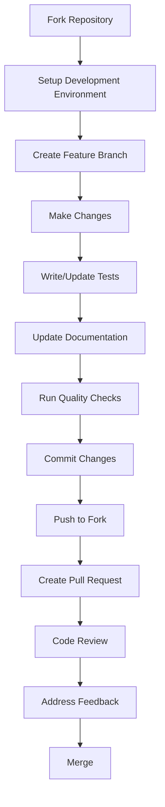

# Contributing to friTap

We welcome contributions to friTap! This guide provides an overview of how to contribute code, documentation, bug reports, and feature requests.

## Developer Guides

Quick access to detailed documentation:

| Guide | Description |
|-------|-------------|
| **[Development Setup](development-setup.md)** | Complete environment setup and tooling |
| **[Coding Standards](coding-standards.md)** | TypeScript and Python style guidelines |
| **[Testing Guide](testing.md)** | Testing strategy and framework usage |
| **[Adding Features](adding-features.md)** | How to add SSL libraries and platform support |
| **[Documentation Guide](documentation.md)** | Writing and maintaining documentation |
| **[Pull Request Process](pull-requests.md)** | Submitting and reviewing contributions |
| **[Community Guidelines](community.md)** | Communication and collaboration |

## Quick Start

### Found a Bug?

1. **Check existing issues** on [GitHub Issues](https://github.com/fkie-cad/friTap/issues)
2. **Create a detailed bug report** with reproduction steps
3. **Include system information** (OS, Python version, friTap version)
4. **Provide sample code or applications** if possible

### Have a Feature Idea?

1. **Search existing feature requests** to avoid duplicates
2. **Open a feature request issue** with detailed description
3. **Explain the use case** and why it would benefit users
4. **Discuss implementation approaches** with maintainers

### Want to Contribute Code?

1. **Fork the repository** and create a feature branch
2. **Set up development environment** (see [Development Setup](development-setup.md))
3. **Follow coding standards** (see [Coding Standards](coding-standards.md))
4. **Add tests** for new functionality (see [Testing Guide](testing.md))
5. **Update documentation** as needed (see [Documentation Guide](documentation.md))
6. **Submit a pull request** (see [Pull Request Process](pull-requests.md))

## Development Overview

### Repository Structure

```
friTap/
├── friTap/                 # Main Python package
│   ├── friTap.py          # CLI application
│   ├── ssl_logger.py      # Core SSL logging
│   ├── android.py         # Android features
│   └── _ssl_log*.js       # Compiled agents (generated)
├── agent/                  # TypeScript Frida agent source
│   ├── ssl_log.ts         # Main agent entry point
│   ├── ssl_lib/          # SSL library implementations
│   ├── shared/           # Shared utilities
│   └── {platform}/       # Platform-specific code
├── docs/                  # Documentation (MkDocs)
├── tests/                 # Test suite
├── ground_truth/         # Test applications
└── requirements*.txt      # Dependencies
```

### Contribution Workflow



## Quick Setup

### Automated Setup (Recommended)

For a complete development environment setup:

```bash
# Clone repository
git clone https://github.com/fkie-cad/friTap.git
cd friTap

# Run automated setup script
python setup_developer_env.py
```

This script will:
- Install Python development dependencies
- Install Node.js dependencies for agent compilation
- Set up frida-compile from frida-tools
- Test agent compilation
- Set up testing environment
- Configure pre-commit hooks
- Set up BoringSecretHunter Docker environment

### Manual Setup

If you prefer manual setup or encounter issues:

```bash
# Python environment
python -m venv venv
source venv/bin/activate  # Linux/macOS
# venv\Scripts\activate   # Windows

# Install development dependencies
pip install -r requirements-dev.txt
pip install -e .

# Node.js dependencies (for TypeScript agent)
npm install

# Install frida-tools for latest frida-compile
pip install --upgrade frida-tools

# Verify setup
python run_tests.py summary
npm run build
```

## Core Development Areas

### 1. **Python Host Application**
- CLI interface and argument parsing
- Process attachment and control
- Output formatting (PCAP, JSON, key logs)
- Platform-specific integrations

### 2. **TypeScript Frida Agent**
- SSL/TLS library hooking implementations
- Cross-platform compatibility code
- Pattern-based and offset-based hooking
- Real-time data processing

### 3. **Testing Framework**
- Unit tests with comprehensive mocking
- Agent compilation validation
- Ground truth application testing
- Cross-platform test coverage

### 4. **Documentation**
- User guides and API references
- Platform-specific examples
- Troubleshooting guides
- Development documentation

## Development Prerequisites

### Required Tools

- **Python 3.7+** (recommended: 3.9+)
- **Node.js 16+** for TypeScript compilation
- **Git** for version control
- **Docker** (optional, for BoringSecretHunter)

### Platform-Specific Requirements

**Linux:**
```bash
sudo apt-get install build-essential python3-dev
```

**macOS:**
```bash
brew install node
xcode-select --install
```

**Windows:**
- Visual Studio Build Tools
- Node.js from [nodejs.org](https://nodejs.org/)

## Development Areas

## First Contribution Ideas

### Beginner-Friendly

- **Fix typos** in documentation
- **Add examples** for existing features
- **Improve error messages** for better user experience
- **Add tests** for existing functionality

### Intermediate

- **Add support** for new applications
- **Improve cross-platform** compatibility
- **Enhance performance** optimizations
- **Add new output formats**

### Advanced

- **Add SSL library support** (OpenSSL variants, new libraries)
- **Implement analysis features** (traffic analysis, pattern detection)
- **Add platform support** (new operating systems)
- **Security improvements** (anti-detection, obfuscation)

## Community

### Communication Channels

- **[GitHub Issues](https://github.com/fkie-cad/friTap/issues)**: Bug reports and feature requests
- **[GitHub Discussions](https://github.com/fkie-cad/friTap/discussions)**: Questions and community discussions
- **[Pull Requests](https://github.com/fkie-cad/friTap/pulls)**: Code contributions and reviews
- **Email**: [daniel.baier@fkie.fraunhofer.de](mailto:daniel.baier@fkie.fraunhofer.de) for direct contact

### Code of Conduct

- **Be respectful** to all community members
- **Be constructive** in feedback and discussions
- **Be inclusive** and welcoming to newcomers
- **Focus on technical merit** of contributions

## Getting Help

**For Users:**
- Check [documentation](https://fkie-cad.github.io/friTap)
- Search [existing issues](https://github.com/fkie-cad/friTap/issues)
- Ask questions in [GitHub Discussions](https://github.com/fkie-cad/friTap/discussions)

**For Contributors:**
- Read the guides linked above
- Review the [Development Setup](development-setup.md) guide
- Join discussions on pull requests
- Contact maintainers for major architectural changes

## Quick Quality Checklist

Before submitting contributions:

```bash
# Code formatting and linting
black friTap/ tests/
flake8 friTap/ tests/
mypy friTap/

# TypeScript compilation
npm run build

# Run tests
python run_tests.py --fast

# Documentation check
mkdocs build
```

## Next Steps

Ready to contribute? Here's how to start:

1. **[Fork the repository](https://github.com/fkie-cad/friTap/fork)**
2. **[Set up your development environment](development-setup.md)**
3. **[Choose an issue to work on](https://github.com/fkie-cad/friTap/issues?q=is%3Aissue+is%3Aopen+label%3A%22good+first+issue%22)**
4. **[Follow the coding standards](coding-standards.md)**
5. **[Submit your pull request](pull-requests.md)**

Thank you for contributing to friTap!

---

**Maintainers**: For release process and advanced maintenance topics, see [Release Process](release-process.md).