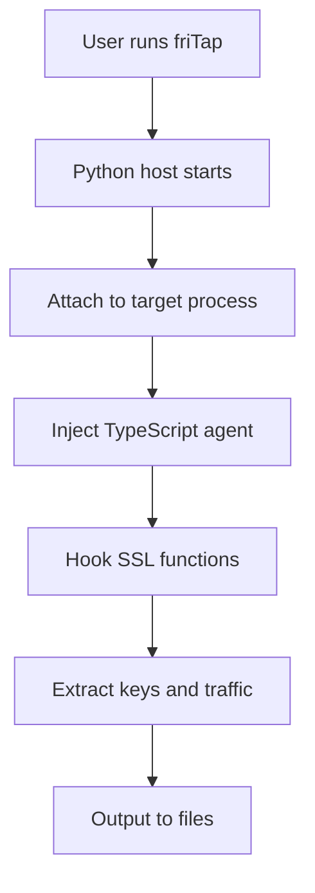

# Documentation Guide

This guide covers how to write, maintain, and contribute to friTap's documentation using MkDocs with Material theme.

## Overview

friTap uses **MkDocs** with the **Material theme** for documentation. This provides:

- **Beautiful, responsive design**
- **Search functionality**
- **Navigation structure**
- **Code syntax highlighting**
- **Markdown-based content**

## Documentation Structure

```
docs/
├── index.md                    # Homepage
├── getting-started/           # User guides
│   ├── installation.md
│   ├── quick-start.md
│   └── first-analysis.md
├── usage/                     # Feature documentation
│   ├── cli-reference.md
│   ├── key-extraction.md
│   └── traffic-analysis.md
├── examples/                  # Practical examples
│   ├── android.md
│   ├── ios.md
│   └── desktop.md
├── libraries/                 # SSL library support
│   ├── openssl.md
│   ├── boringssl.md
│   └── others.md
├── advanced/                  # Advanced topics
│   ├── patterns.md
│   ├── custom-scripts.md
│   └── troubleshooting.md
├── api/                       # API documentation
│   ├── python.md
│   └── cli.md
├── development/               # Development guides
│   ├── contributing.md
│   ├── development-setup.md
│   ├── coding-standards.md
│   ├── testing.md
│   ├── adding-features.md
│   ├── documentation.md       # This file
│   ├── pull-requests.md
│   └── community.md
└── assets/                    # Images and resources
    ├── images/
    └── downloads/
```

## Writing Documentation

### Style Guide

#### Voice and Tone
- **Clear and concise**: Avoid unnecessary complexity
- **User-focused**: Write from the user's perspective
- **Action-oriented**: Use active voice and imperatives
- **Inclusive**: Welcome to all skill levels

#### Language Guidelines
```markdown
# Good examples
✅ "Run the following command to install friTap:"
✅ "This extracts SSL keys from the target application."
✅ "You can configure friTap using command-line options."

# Avoid
❌ "It is possible to run the command below for friTap installation:"
❌ "SSL keys may be extracted by friTap from applications."
❌ "Configuration of friTap can be done through options."
```

#### Formatting Standards

**Headers**: Use descriptive, hierarchical headings
```markdown
# Main Topic
## Subtopic
### Specific Feature
#### Implementation Detail
```

**Code Blocks**: Always specify language for syntax highlighting
```markdown
```bash
fritap -k keys.log target_app
```

```python
from friTap import SSL_Logger
logger = SSL_Logger("target_app")
```

```typescript
import { log } from "./util/log.js";
log("TypeScript example");
```
```

**Links**: Use descriptive link text
```markdown
✅ [Installation Guide](getting-started/installation.md)
✅ See the [CLI Reference](api/cli.md) for all options

❌ [Click here](getting-started/installation.md)
❌ More info [here](api/cli.md)
```

**Images**: Always include alt text and descriptive captions
```markdown


*Figure 1: friTap's two-component architecture with Python host managing the TypeScript Frida agent*
```

### Content Structure

#### Standard Page Template
```markdown
# Page Title

Brief description of what this page covers and who it's for.

## Overview

More detailed explanation of the topic, including:
- Why this feature/topic is important
- When to use it
- Prerequisites or requirements

## Basic Usage

Start with the simplest, most common use case:

```bash
# Simple example that works immediately
fritap -k keys.log target_app
```

Explain what this does and what to expect.

## Advanced Usage

Build up to more complex scenarios:

```bash
# More complex example with multiple options
fritap -k keys.log -p traffic.pcap --patterns patterns.json target_app
```

## Examples

### Example 1: Common Use Case
Practical, real-world example with full context.

### Example 2: Advanced Scenario
More sophisticated example showing advanced features.

## Troubleshooting

Common issues and their solutions:

### Issue: Problem Description
**Symptoms**: What the user sees
**Cause**: Why this happens
**Solution**: Step-by-step fix

## Next Steps

Links to related documentation or logical next topics.
```

#### Code Examples

**Provide complete, working examples**:
```markdown
## Complete Android Analysis Example

This example demonstrates a full SSL analysis workflow on Android:

```bash
# 1. Check device connection
adb devices

# 2. Start frida-server (if not running)
adb shell su -c "/data/local/tmp/frida-server &"

# 3. Run friTap analysis
fritap -m -k android_keys.log -p android_traffic.pcap com.example.app

# 4. Verify results
ls -la android_keys.log android_traffic.pcap
grep "CLIENT_RANDOM" android_keys.log
```

**Expected output**:
```
$ grep "CLIENT_RANDOM" android_keys.log
CLIENT_RANDOM 52345678901234... ABCDEF123456789...
CLIENT_RANDOM 87654321098765... FEDCBA987654321...
```
```

**Explain what each step does**:
```markdown
1. **Device connection**: Verify Android device is connected via ADB
2. **Frida server**: Ensure frida-server is running with root privileges
3. **Analysis**: Run friTap in mobile mode (`-m`) with key and PCAP output
4. **Verification**: Check that files were created and contain expected data
```

#### Admonitions

Use MkDocs admonitions for important information:

```markdown
!!! note "Platform Support"
    This feature is only available on Linux and Android platforms.

!!! warning "Root Required"
    This operation requires root access on the target device.

!!! tip "Performance Optimization"
    Use the `--fast` flag for quicker analysis when full features aren't needed.

!!! danger "Security Warning"
    Never run friTap on production systems without proper authorization.

!!! info "Version Compatibility"
    This feature requires friTap 1.3.5+ and Frida 16.0+.

!!! example "Quick Example"
    ```bash
    fritap -k keys.log firefox
    ```
```

### API Documentation

#### Function Documentation

Use consistent format for API documentation:

```markdown
## extract_ssl_keys()

Extract SSL/TLS keys from a target application.

**Signature**:
```python
def extract_ssl_keys(
    target: str,
    output_file: Optional[str] = None,
    mobile: bool = False,
    timeout: int = 30
) -> Dict[str, Any]:
```

**Parameters**:

| Parameter | Type | Default | Description |
|-----------|------|---------|-------------|
| `target` | `str` | Required | Target application name, path, or PID |
| `output_file` | `str \| None` | `None` | File to save extracted keys (NSS Key Log format) |
| `mobile` | `bool` | `False` | Enable mobile analysis mode |
| `timeout` | `int` | `30` | Maximum time to wait for analysis (seconds) |

**Returns**:

`Dict[str, Any]` - Analysis results containing:
- `keys`: List of extracted SSL keys
- `metadata`: Session information and statistics
- `errors`: Any errors encountered during analysis

**Raises**:

- `FridaError`: When Frida injection fails
- `PermissionError`: When insufficient privileges
- `TimeoutError`: When analysis exceeds timeout

**Example**:
```python
from friTap import SSL_Logger

# Basic key extraction
logger = SSL_Logger()
results = logger.extract_ssl_keys("firefox", "keys.log")

print(f"Extracted {len(results['keys'])} SSL keys")
for key in results['keys']:
    print(f"Key: {key[:50]}...")
```
```

#### CLI Documentation

Use consistent format for CLI options:

```markdown
## -k, --keylog PATH

Save TLS keys to file in NSS Key Log format.

**Usage**:
```bash
fritap -k keys.log target_app
fritap --keylog session_keys.log target_app
```

**Format**: The output file uses the NSS Key Log format:
```
CLIENT_RANDOM <32-byte-hex> <48-byte-hex-master-secret>
CLIENT_RANDOM <32-byte-hex> <48-byte-hex-master-secret>
...
```

**Example**:
```bash
# Extract keys from Firefox
fritap -k firefox_keys.log firefox

# View extracted keys
head firefox_keys.log
```

**Related Options**:
- [`-p, --pcap`](../api/cli.md#pcap): Combine with PCAP capture
- [`-v, --verbose`](../api/cli.md#verbose): Show detailed key extraction progress

**Troubleshooting**:
- If no keys are extracted, ensure the application uses supported SSL libraries
- Check debug output with `-do` flag for detailed library detection
```

## MkDocs Configuration

### Local Development

```bash
# Install MkDocs and dependencies
pip install mkdocs mkdocs-material

# Serve documentation locally
mkdocs serve

# Open browser to http://127.0.0.1:8000
```

### Configuration File

The `mkdocs.yml` file controls documentation structure:

```yaml
site_name: friTap Documentation
site_description: Dynamic SSL/TLS analysis with Frida
site_url: https://fkie-cad.github.io/friTap

# Repository information
repo_name: fkie-cad/friTap
repo_url: https://github.com/fkie-cad/friTap
edit_uri: edit/main/docs/

# Theme configuration
theme:
  name: material
  palette:
    - scheme: default
      primary: blue
      accent: blue
      toggle:
        icon: material/brightness-7
        name: Switch to dark mode
    - scheme: slate
      primary: blue
      accent: blue
      toggle:
        icon: material/brightness-4
        name: Switch to light mode
  features:
    - navigation.tabs
    - navigation.sections
    - navigation.expand
    - navigation.top
    - search.highlight
    - search.share
    - content.code.copy

# Extensions
markdown_extensions:
  - admonition
  - pymdownx.details
  - pymdownx.superfences
  - pymdownx.highlight:
      anchor_linenums: true
  - pymdownx.inlinehilite
  - pymdownx.snippets
  - pymdownx.tabbed:
      alternate_style: true
  - pymdownx.tasklist:
      custom_checkbox: true
  - tables
  - toc:
      permalink: true

# Navigation structure
nav:
  - Home: index.md
  - Getting Started:
    - Installation: getting-started/installation.md
    - Quick Start: getting-started/quick-start.md
    - First Analysis: getting-started/first-analysis.md
  - Usage:
    - CLI Reference: api/cli.md
    - Key Extraction: usage/key-extraction.md
    - Traffic Analysis: usage/traffic-analysis.md
  - Examples:
    - Android: examples/android.md
    - iOS: examples/ios.md
    - Desktop: examples/desktop.md
  - Libraries:
    - Overview: libraries/index.md
    - OpenSSL: libraries/openssl.md
    - BoringSSL: libraries/boringssl.md
    - Others: libraries/others.md
  - Advanced:
    - Pattern-Based Hooking: advanced/patterns.md
    - Custom Scripts: advanced/custom-scripts.md
    - Troubleshooting: advanced/troubleshooting.md
  - Development:
    - Contributing: development/contributing.md
    - Development Setup: development/development-setup.md
    - Coding Standards: development/coding-standards.md
    - Testing: development/testing.md
    - Adding Features: development/adding-features.md
    - Documentation: development/documentation.md
    - Pull Requests: development/pull-requests.md
    - Community: development/community.md

# Plugins
plugins:
  - search
  - git-revision-date-localized:
      type: date
```

### Building and Deployment

```bash
# Build documentation
mkdocs build

# Deploy to GitHub Pages (maintainers only)
mkdocs gh-deploy

# Check for broken links
mkdocs build --strict
```

## Content Guidelines

### Screenshots and Images

#### Creating Screenshots
- Use consistent browser/terminal settings
- Capture at standard resolution (1920x1080 preferred)
- Show relevant context (don't crop too tightly)
- Use consistent styling across screenshots

#### Image Optimization
```bash
# Optimize PNG images
optipng -o7 assets/images/screenshot.png

# Convert to WebP for better compression
cwebp -q 80 assets/images/screenshot.png -o assets/images/screenshot.webp
```

#### Image Placement
```markdown
# Center important diagrams
<div align="center">

*friTap's modular architecture*
</div>

# Inline screenshots with text
The friTap CLI provides comprehensive options:


As shown above, the `-k` option enables key logging.
```

### Code Examples

#### Example Quality Standards
- **Complete**: Include all necessary imports and setup
- **Tested**: Verify examples work as documented
- **Commented**: Explain non-obvious parts
- **Realistic**: Use realistic data and scenarios

#### Python Examples
```python
# Complete example with imports and error handling
import logging
from friTap import SSL_Logger

# Configure logging
logging.basicConfig(level=logging.INFO)

try:
    # Initialize SSL logger
    logger = SSL_Logger(
        target="firefox",
        mobile=False,
        verbose=True
    )
    
    # Start key extraction
    with logger:
        results = logger.extract_keys("firefox_keys.log")
        
        print(f"Analysis complete:")
        print(f"  Keys extracted: {len(results['keys'])}")
        print(f"  Libraries detected: {results['metadata']['libraries']}")
        print(f"  Duration: {results['metadata']['duration']:.2f}s")
        
except Exception as e:
    print(f"Error: {e}")
    print("Try running with sudo or check if target process exists")
```

#### CLI Examples
```bash
# Show command progression and expected output
$ fritap --version
friTap 1.3.5.0

$ fritap -k keys.log firefox
[*] Starting friTap analysis
[*] Target: firefox (PID: 12345)
[*] Detected libraries: OpenSSL 1.1.1
[*] SSL hooks installed successfully
[*] Key extraction active
[*] Press Ctrl+C to stop

# After user browses some HTTPS sites
^C
[*] Analysis stopped
[*] Extracted 5 SSL keys to keys.log

$ head keys.log
CLIENT_RANDOM 52345678... ABCDEF123456...
CLIENT_RANDOM 87654321... FEDCBA987654...
```

### Cross-References

#### Internal Links
```markdown
# Good cross-referencing
For installation instructions, see the [Installation Guide](../getting-started/installation.md).

Learn more about pattern-based hooking in [Advanced Patterns](../advanced/patterns.md#pattern-based-hooking).

Complete CLI options are documented in the [CLI Reference](../api/cli.md).
```

#### External Links
```markdown
# External resources
friTap is built on [Frida](https://frida.re/), a dynamic instrumentation toolkit.

SSL key logs can be imported into [Wireshark](https://www.wireshark.org/docs/wsug_html_chunked/ChAdvDecrypt.html) for traffic analysis.

For Android development, install the [Android SDK](https://developer.android.com/studio).
```

### Version-Specific Information

#### Feature Availability
```markdown
!!! info "Version Requirements"
    This feature requires:
    
    - friTap 1.3.5+
    - Frida 16.0+
    - Python 3.7+
    
    For older versions, see [Legacy Documentation](legacy.md).
```

#### Deprecation Notices
```markdown
!!! warning "Deprecated Feature"
    The `--legacy-mode` option is deprecated as of friTap 1.4.0 and will be removed in 2.0.0.
    
    **Migration**: Use `--compatibility-mode` instead:
    ```bash
    # Old (deprecated)
    fritap --legacy-mode target_app
    
    # New
    fritap --compatibility-mode target_app
    ```
```

## Content Review Process

### Self-Review Checklist

Before submitting documentation:

- [ ] **Accuracy**: All examples tested and working
- [ ] **Completeness**: All necessary information included
- [ ] **Clarity**: Clear for target audience
- [ ] **Consistency**: Follows style guide
- [ ] **Links**: All internal/external links work
- [ ] **Grammar**: Proofread for errors
- [ ] **Images**: Screenshots current and relevant

### Peer Review

Documentation changes should be reviewed for:

1. **Technical accuracy**: Examples work as documented
2. **User experience**: Clear navigation and information flow
3. **Consistency**: Matches existing documentation style
4. **Completeness**: Covers all necessary aspects

### Testing Documentation

```bash
# Test all code examples
cd docs/examples
python test_python_examples.py

# Test CLI examples
bash test_cli_examples.sh

# Check for broken links
mkdocs build --strict
```

## Maintenance Tasks

### Regular Updates

#### Keep Examples Current
- Test examples with each release
- Update for new features
- Remove deprecated functionality
- Refresh screenshots when UI changes

#### Link Maintenance
```bash
# Check for broken internal links
grep -r "\.md)" docs/ | grep -v "http" | while read line; do
    file=$(echo $line | cut -d: -f1)
    link=$(echo $line | grep -o "([^)]*\.md[^)]*)")
    # Verify link target exists
done

# Check external links (use link checker tool)
markdown-link-check docs/**/*.md
```

#### Version Updates
Update version references when releasing:

```bash
# Find version references
grep -r "1\.3\.5" docs/

# Update systematically
sed -i 's/1\.3\.5/1\.4\.0/g' docs/**/*.md
```

### Analytics and Feedback

Monitor documentation usage:

- **Google Analytics**: Track popular pages
- **GitHub Issues**: Documentation feedback
- **Community Questions**: Common confusion points
- **Support Requests**: Areas needing clarification

### Content Audits

Quarterly content review:

1. **Accuracy audit**: Verify all examples work
2. **Completeness audit**: Identify gaps
3. **User flow audit**: Test common user journeys
4. **Performance audit**: Check page load times

## Advanced Features

### Custom Extensions

#### Code Block Enhancements
```markdown
```python title="ssl_analysis.py" linenums="1"
from friTap import SSL_Logger

logger = SSL_Logger("target_app")
results = logger.extract_keys()
```
```

#### Tabbed Content
```markdown
=== "Linux"
    ```bash
    sudo fritap -k keys.log target_app
    ```

=== "Windows"
    ```powershell
    fritap -k keys.log target_app
    ```

=== "macOS"
    ```bash
    sudo fritap -k keys.log target_app
    ```
```

#### Mermaid Diagrams
```markdown

```

### Search Optimization

#### Search-Friendly Content
- Use descriptive headings
- Include synonyms and alternative terms
- Add metadata for better indexing

```markdown
---
title: SSL Key Extraction Guide
description: Learn how to extract SSL/TLS keys using friTap for traffic decryption
keywords: ssl, tls, key extraction, frida, dynamic analysis, crypto
---

# SSL Key Extraction Guide

Extract SSL/TLS encryption keys from applications for traffic analysis and decryption.

Also known as: TLS key logging, master secret extraction, crypto key dumping
```

## Troubleshooting Documentation Issues

### Common Problems

#### Build Failures
```bash
# Check MkDocs configuration
mkdocs build --verbose

# Validate YAML syntax
python -c "import yaml; yaml.safe_load(open('mkdocs.yml'))"

# Check for encoding issues
file docs/**/*.md | grep -v "UTF-8"
```

#### Navigation Issues
```bash
# Verify all navigation files exist
python scripts/check_nav.py mkdocs.yml

# Check for orphaned files
find docs/ -name "*.md" -not -path "*/.*" | while read file; do
    if ! grep -q "$file" mkdocs.yml; then
        echo "Orphaned: $file"
    fi
done
```

#### Link Problems
```bash
# Find broken internal links
python scripts/check_internal_links.py docs/

# Check external links
markdown-link-check docs/**/*.md --config .markdown-link-check.json
```

### Performance Issues

#### Large Images
```bash
# Find large images
find docs/assets/images -type f -size +500k

# Optimize automatically
for img in docs/assets/images/*.png; do
    optipng -o7 "$img"
done
```

#### Slow Builds
- Minimize large files
- Use incremental builds during development
- Optimize images and assets
- Consider lazy loading for heavy content

## Next Steps

After reviewing this documentation guide:

1. **Set up local environment**: Install MkDocs and dependencies
2. **Choose content to improve**: Start with areas you know well
3. **Follow style guidelines**: Use templates and standards
4. **Test thoroughly**: Verify examples and links
5. **Submit for review**: Use [Pull Request Process](pull-requests.md)

For more information:
- **[Development Setup](development-setup.md)**: Environment configuration  
- **[Contributing Guide](contributing.md)**: Overall contribution workflow
- **[Pull Request Process](pull-requests.md)**: Code review and submission