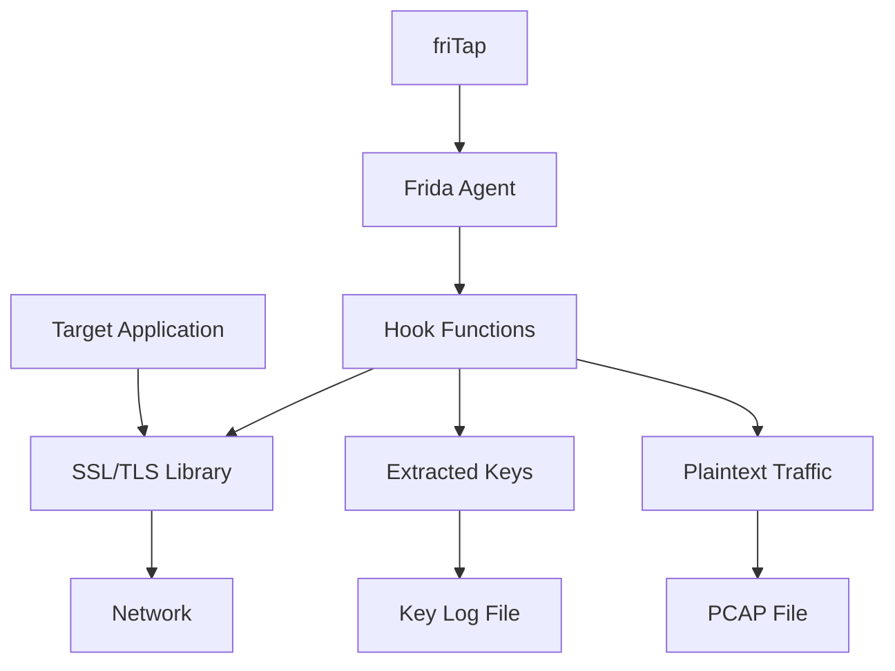

# Basic Concepts

Understanding the fundamental concepts behind friTap will help you use it more effectively and troubleshoot issues when they arise.

## How friTap Works

### Dynamic Instrumentation

friTap uses [Frida](https://frida.re/), a dynamic instrumentation framework, to:

1. **Attach to running processes** or spawn new ones
2. **Inject JavaScript code** into the target process
3. **Hook SSL/TLS library functions** to intercept data
4. **Extract keys and plaintext** without modifying the application

### The Hooking Process



## Core Components

### 1. friTap CLI

The command-line interface that:
- Manages Frida connections
- Handles device communication
- Processes output files
- Provides user feedback

### 2. Frida Agent

JavaScript code that runs inside the target process:
- Detects SSL/TLS libraries
- Hooks key functions
- Extracts data and keys
- Sends results back to CLI

### 3. SSL/TLS Library Handlers

Platform-specific code for different libraries:
- **OpenSSL/BoringSSL**: Most common, full support
- **NSS**: Mozilla's library, widely used
- **GnuTLS**: GNU TLS implementation
- **WolfSSL**: Embedded/IoT focused
- **mbedTLS**: Lightweight implementation

## Key Concepts

### Process Attachment vs Spawning

**Attachment**: Connect to an already running process
```bash
# Attach to running Firefox
fritap firefox
```

**Spawning**: Start a new process under friTap control
```bash
# Spawn new Firefox instance
fritap -f firefox
```

### Mobile vs Desktop Analysis

**Desktop Mode** (default):
- Requires root/admin privileges
- Hooks system libraries
- Works with any application

**Mobile Mode** (`-m` flag):
- Requires rooted/jailbroken device
- Hooks app-specific libraries
- Handles Android/iOS specifics

### Key Extraction vs Traffic Decryption

**Key Extraction** (`-k` flag):
- Captures TLS keys as they're generated
- Smaller file size
- Requires separate network capture (e.g. with the `-full_capture` flag)
- Compatible with Wireshark

**Traffic Decryption** (`--pcap` flag):
- Captures decrypted plaintext traffic
- Larger file size
- Self-contained analysis
- Ready for immediate analysis

## SSL/TLS Library Detection

friTap automatically detects which libraries are loaded:

### Detection Methods

1. **Library Enumeration**: List loaded modules
2. **Symbol Resolution**: Check for known function names
3. **Pattern Matching**: Use byte patterns for stripped libraries
4. **Heuristic Analysis**: Analyze library behavior

### Library Priority

When multiple libraries are detected:
1. **OpenSSL/BoringSSL**: Highest priority
2. **NSS**: Second priority
3. **GnuTLS**: Third priority
4. **Others**: Based on platform support

## Hooking Strategies

### Symbol-Based Hooking

Default method when symbols are available:
```javascript
// Hook SSL_read function
const SSL_read = Module.getExportByName("libssl.so", "SSL_read");
Interceptor.attach(SSL_read, {
    onEnter: function(args) {
        // Capture arguments
    },
    onLeave: function(retval) {
        // Capture return value and data
    }
});
```

### Pattern-Based Hooking

When working with libraries that have been stripped of symbols, you can use pattern-based hooking to identify and hook functions based on byte patterns:
```bash
# Use pattern file
fritap --patterns patterns.json target
```

Currently, pattern-based hooking is only supported for dumping TLS key material in the NSS key log format (([more](https://github.com/fkie-cad/friTap/blob/main/USAGE.md#1-dump-keys)). We also include default pattern files for several commonly used libraries to get you started quickly.

### Offset-Based Hooking

For known memory layouts:
```bash
# Use offset file
fritap --offsets offsets.json target
```

## Data Flow

### Key Extraction Flow

1. **Key Generation**: Application generates TLS keys
2. **Hook Interception**: friTap hooks key callback functions
3. **Key Capture**: Extract master secrets and randoms
4. **Format Conversion**: Convert to NSS Key Log format
5. **File Output**: Save to specified key log file

### Traffic Decryption Flow

1. **Read/Write Hooks**: Intercept SSL_read/SSL_write calls
2. **Plaintext Capture**: Extract plaintext before encryption/after decryption
3. **Socket Information**: Gather connection details (IP, port)
4. **Packet Reconstruction**: Rebuild network packets
5. **PCAP Generation**: Save as standard PCAP file

## Platform Differences

Since friTap depends on Frida, it requires root (or administrator) privileges on every platform.

### Linux
- System-wide SSL libraries
- Process attachment requires root
- Broad library support
- *SELinux*: On distributions enforcing SELinux (e.g., Fedora, RHEL, Android kernels), Frida may be blocked by mandatory policies. Switch to permissive mode:
    ```bash
    setenforce 0
    ```

### Windows
- Multiple SSL implementations
- Admin privileges required
- Limited library support
- Windows 11 lsass.exe crash: By default, hardware-enforced stack protection triggers a crash when Frida hooks lsass.exe. To mitigate:
    1. Open Settings → Privacy & security → Windows Security → App & browser control → Exploit protection settings.
    2. Under Program settings, add lsass.exe and override Hardware-enforced stack protection (set to *Off*)
- General [LSA protections](https://learn.microsoft.com/en-us/windows-server/security/credentials-protection-and-management/configuring-additional-lsa-protection) & AV: Many antivirus solutions flag or harden LSASS. If you receive Access Denied ensure all LSA protections are disabled (e.g., registry keys for LSA hardening) and temporarily disable AV hooks

### macOS
- System Integrity Protection (SIP) might be a problem
- Code signing restrictions
- Limited library support

It is very likely that you have to deactivate the System Integrity Protection (SIP) on your Mac OS system.
Disabling SIP (Intel & Apple Silicon):

    1. Reboot into Recovery mode (Intel: hold `⌘ R`; Apple Silicon: hold Power until `Loading startup options`).

    2. Launch *Utilities* → *Terminal*.

    3. Run `csrutil disable` 

### Android
- App-specific libraries
- Java and native SSL implementations
- Requires root access
- On Samsung devices it might be required to disable KNOX:
    ```bash
    adb shell pm disable-user --user 0 com.samsung.android.knox.attestation
    adb reboot
    ```

### iOS
- Objective-C SSL implementations
- Jailbreak required
- Limited library support
- Frida-server on jailbroken iOS:

    1. Ensure your device is jailbroken (palera1n, Checkra1n, etc.).

    2. Add https://build.frida.re to Cydia/Zebra/Sileo sources.

    3. Install the matching frida-server DEB and run it as root.

## Common Architectures

### Client-Server Applications

```
[Client/Mobile App] --TLS--> [Server]
     |
   friTap
     |
[Keys/Traffic]
```

### Multi-Process Applications

```
[Parent Process] --> [Child Process 1] --TLS--> [Server]
                 --> [Child Process 2] --TLS--> [Server]
        |
      friTap
        |
   [All Traffic]
```

## Security Considerations

### Defensive Measures

Applications may implement:
- **Anti-debugging**: Detect instrumentation
- **SSL Pinning**: Validate certificates
- **Root Detection**: Refuse to run on rooted devices
- **Code Obfuscation**: Hide SSL library usage

### friTap Countermeasures

- **Anti-root bypass**: Disable root detection
- **Spawn gating**: Intercept child processes
- **Pattern matching**: Hook obfuscated libraries
- **Multiple strategies**: Fallback mechanisms

## Performance Considerations

### Memory Usage

- **Agent injection**: ~10-50MB per process
- **Key storage**: Minimal (few KB)
- **Traffic capture**: Proportional to traffic volume

### CPU Overhead

- **Minimal impact**: <5% for most applications
- **Hook efficiency**: Optimized interception
- **Selective hooking**: Only hook necessary functions

### Network Impact

- **No network changes**: friTap doesn't modify network traffic
- **Passive monitoring**: Read-only access to data
- **Real-time processing**: Minimal latency

## Troubleshooting Concepts

### Common Issues

1. **No hooks installed**: Library not detected
2. **No traffic captured**: Wrong socket information
3. **Crashes**: Incompatible hooking strategy
4. **Missing keys**: Key callback not hooked

### Debug Information

```bash
# Enable debug output
fritap -do -v target

# Check library detection
fritap --list-libraries target

# Verify device connection
frida-ls-devices 
Id              Type    Name             OS
--------------  ------  ---------------  ------------
local           local   Local System     macOS 15.3.1
31041FDH2006EY  usb     Pixel 7          Android 13
barebone        remote  GDB Remote Stub
socket          remote  Local Socket
```

## Advanced Concepts

### Custom Frida Scripts

Extend friTap with custom JavaScript:
```bash
fritap -c custom_script.js target
```

### Multi-Device Analysis

Analyze multiple devices simultaneously:
```bash
# Device 1
fritap -m -D device1 com.example.app

# Device 2
fritap -m -D device2 com.example.app
```

### Live Analysis Integration

Real-time analysis with external tools:
```bash
# Named pipe to Wireshark
fritap -l target

# JSON output to external tool
fritap --json target | analysis_tool
```

## Best Practices

### 1. Start with Simple Cases

Begin with well-known applications:
```bash
fritap -k keys.log curl https://httpbin.org/get
```

### 2. Use Verbose Mode for Learning

```bash
fritap -v target
```

To get even more insights use the debug output (`-do`) parameter as well:
```bash
fritap -v -do target
```

### 3. Understand Your Target

- Know which SSL library is used
- Understand the application architecture
- Consider security measures

### 4. Test Incrementally

1. Test key extraction first
2. Add traffic capture
3. Enable advanced features
4. Optimize performance

### 5. Document Your Findings

Keep track of:
- Working command lines
- Library versions
- Platform specifics
- Custom patterns/offsets

## Next Steps

Now that you understand the basics:

1. **Practice with [Usage Examples](../examples/index.md)**
2. **Learn platform-specific details in [Platform Guides](../platforms/android.md)**
3. **Explore [Advanced Features](../advanced/patterns.md)**
4. **Read about specific [SSL/TLS Libraries](../libraries/index.md)**