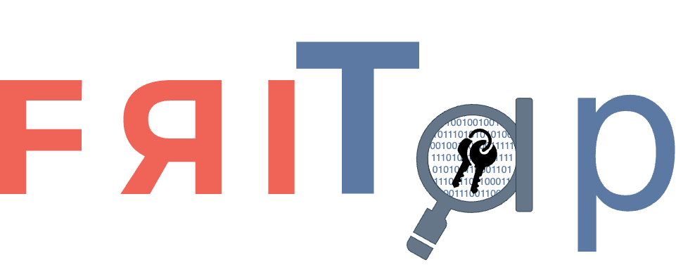

# friTap Documentation

<div align="center">
    
    <h2>SSL/TLS Traffic Analysis Made Simple</h2>
    <!-- Updated for MkDocs deployment -->
    <p><strong>Real-time key extraction and traffic decryption for security research</strong></p>
</div>

## Quick Start

```bash
# Install friTap
pip install fritap

# Basic usage - Desktop application
sudo fritap --pcap capture.pcap firefox

# Mobile application analysis
fritap -m -k keys.log com.example.app
```

## What is friTap?

friTap is a powerful cybersecurity research tool that simplifies SSL/TLS traffic analysis by automating key extraction and traffic decryption. Built on the Frida dynamic instrumentation framework, friTap enables security researchers to analyze encrypted network communications in real-time across multiple platforms.

### Key Capabilities

- **Real-time Key Extraction**: Automatically extract TLS keys as they're generated
- **Live Traffic Decryption**: Decrypt and save TLS payload as PCAP files
- **Multi-Platform Support**: Works on Linux, Windows, macOS, Android, and iOS
- **Extensive Library Support**: Supports OpenSSL, BoringSSL, NSS, GnuTLS, WolfSSL, and more
- **Pattern-Based Hooking**: Hook stripped libraries without symbols
- **Advanced Analysis**: Bypass anti-analysis techniques and SSL pinning

### Use Cases

- **Malware Analysis**: Decrypt C&C communications and data exfiltration
- **Privacy Research**: Analyze application data transmission practices
- **Security Testing**: Validate SSL/TLS implementations and configurations
- **Digital Forensics**: Recover encrypted network communications
- **Application Analysis**: Understand how applications handle secure communications

## How It Works

friTap uses dynamic instrumentation to intercept SSL/TLS operations at the library level:

1. **Library Detection**: Automatically identifies the SSL/TLS library used by the target application
2. **Hook Injection**: Dynamically hooks key functions (read, write, key generation)
3. **Data Extraction**: Captures plaintext data and encryption keys in real-time
4. **Output Generation**: Saves results as PCAP files or key logs for analysis


## Supported Platforms & Libraries

| Library | Linux | Windows | macOS | Android | iOS | Key Features |
|---------|-------|---------|-------|---------|-----|--------------|
| **OpenSSL** | ✓ Full | R/W | TBI | ✓ Full | TBI | Most widely used |
| **BoringSSL** | ✓ Full | R/W | Keys | ✓ Full | Keys | Google's OpenSSL fork |
| **NSS** | ✓ Full | R/W | TBI | Keys | TBI | Mozilla's library |
| **GnuTLS** | R/W | R/W | TBI | ✓ Full | TBI | GNU project library |
| **WolfSSL** | R/W | R/W | TBI | ✓ Full | TBI | Embedded/IoT focused |
| **mbedTLS** | R/W | R/W | TBI | ✓ Full | TBI | Lightweight library |
| **Schannel** | ✗ | ✓ Full | ✗ | ✗ | ✗ | Windows native SSL/TLS |
| **Conscrypt** | TBA | TBA | TBA | ✓ Full | TBA | Android system SSL |
| **S2N-TLS** | ✓ Full | ✗ | TBA | ✓ Full | ✗ | AWS library |
| **RustTLS** | Keys | TBI | TBI | Keys | TBI | Rust implementation |

**Legend:**
- ✓ **Full**: Complete support (keys + traffic decryption)
- **R/W**: Read/Write hooks only (traffic without keys)
- **Keys**: Key extraction only
- **TBI**: To Be Implemented
- **TBA**: To Be Analyzed
- ✗ **N/A**: Not applicable to platform

## Getting Started

### Prerequisites

- Python 3.7+
- Frida 16.0+ (new changes will only work on frida >=17)
- Administrative privileges (for desktop applications)
- ADB access (for Android analysis)

### Installation

```bash
# Install from PyPI
pip install fritap

# Verify installation
fritap --help
```

### Basic Examples

=== "Desktop Application"
    ```bash
    # Capture Firefox traffic
    sudo fritap --pcap firefox_traffic.pcap firefox
    
    # Extract keys from Thunderbird
    sudo fritap -k thunderbird_keys.log thunderbird
    ```

=== "Android Application"
    ```bash
    # Analyze mobile app with key extraction
    fritap -m -k keys.log com.example.app
    
    # Full packet capture with decryption
    fritap -m --pcap decrypted.pcap com.example.app
    ```

=== "Pattern-Based Hooking"
    ```bash
    # Hook libraries without symbols when the default patterns not working
    fritap --patterns patterns.json -k keys.log target_app
    
    # Debug pattern matching
    fritap -do -v --patterns patterns.json target_app
    ```

## Documentation Sections

### [Getting Started](getting-started/installation.md)
Installation, setup, and basic concepts to get you up and running quickly.

### [Usage Examples](examples/index.md)
Comprehensive examples for different platforms and use cases with real-world scenarios.

### [Platform Guides](platforms/android.md)
Detailed guides for Android, iOS, Linux, Windows, and macOS analysis.

### [Advanced Features](advanced/patterns.md)
Pattern-based hooking, spawn gating, anti-detection techniques, and custom scripts.

### [API Reference](api/python.md)
Complete API documentation for Python integration and CLI usage.

### [Troubleshooting](troubleshooting/common-issues.md)
Solutions for common issues, debugging techniques, and performance optimization.

## Community & Support

- **GitHub**: [fkie-cad/friTap](https://github.com/fkie-cad/friTap)
- **Email**: daniel.baier@fkie.fraunhofer.de
- **Research**: [OSDFCon Webinar](https://github.com/fkie-cad/friTap/blob/main/assets/friTapOSDFConwebinar.pdf)
- **Blog**: [Technical Deep Dive](https://lolcads.github.io/posts/2022/08/fritap/)

## License

friTap is released under the [GPL v3 License](https://github.com/fkie-cad/friTap/blob/main/LICENSE).

---

*Inspired by [SSL_Logger](https://github.com/google/ssl_logger) and developed by [Fraunhofer FKIE CAD](https://www.fkie.fraunhofer.de/en/departments/cad.html)*


